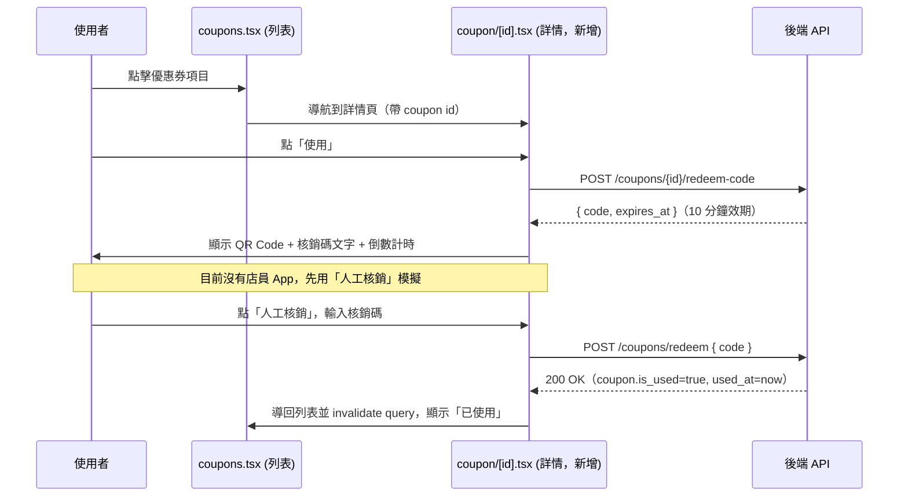

# Plan: 優惠券使用／核銷（前端）

## Goal
`coupons.tsx` 目前只能「看」優惠券列表，`is_used` / `used_at` 欄位已經存在於 `Coupon` 型別卻沒有任何路徑能把它改成已使用。這次要補上「使用」的動作。完成定義：使用者在優惠券詳情頁按「使用」，畫面產生一組限時的核銷碼並顯示 QR Code；因為目前還沒有另一個店員核銷 App，先在同一支 App 裡加一個「人工核銷」按鈕，讓使用者輸入該核銷碼並送出即可完成核銷（模擬未來店員掃 QR Code 的動作），核銷成功後優惠券列表要顯示「已使用」。

後端（FastAPI，由 `back-end` session 負責）需新增產生核銷碼、驗證核銷碼的 API 與資料庫欄位，規格已透過跨 session 訊息與 back-end 確認可行（見下方「back-end 已確認的設計」），back-end 表示這個功能不需要外部服務，正在直接動工。

## 已與使用者確認的決策
- 採用 A+B 混合模式：畫面同時提供「顯示 QR Code」（供未來店員 App 掃描）與「人工核銷」（輸入驗證碼即可核銷，測試用，模擬店員掃碼後的動作）
- 目前**沒有**另一個店員核銷 App，QR Code 目前只是產生內容備用，實際核銷測試靠「人工核銷」輸入框完成
- 明確已知限制：人工核銷目前是同一支 App、用消費者自己的 JWT 呼叫核銷 API，等於沒有真正的店員驗證。**正式上線前**，核銷 API 應該要改成需要店員/商家專屬的身分驗證，不能讓消費者自己核銷自己的優惠券——這點已記錄，等未來真的要做店員 App 時再處理

## Architecture / flow

## Scope

### 前端 May modify
- `app/(tabs)/coupons.tsx`：卡片改用 `Pressable`，點擊後 `router.push` 導向詳情頁
- 新增 `app/coupon/[id].tsx`：優惠券詳情頁，狀態機為「顯示優惠券資訊 → 按使用產生核銷碼 → 顯示 QR Code + 人工核銷輸入框 → 核銷成功導回列表」
- `package.json`：新增 `react-native-qrcode-svg`、`react-native-svg`（QR Code 渲染，含原生模組，需要重新建置 Dev Client）
- `types/index.ts`：`Coupon` 型別不需改動；新增一個 `RedeemCodeResponse` 型別（`{ code: string; expires_at: string }`）供 API 回應用

### 必須不修改（Core）
- `store/useAuthStore.ts`、`services/api.ts`：沿用既有機制
- 既有的優惠券列表查詢邏輯（`['myCoupons']` query key）：只在核銷成功後呼叫 `invalidateQueries`，不改變原本的抓取方式

### 後端（由 back-end session 負責，前端不直接修改）
- 新增 `POST /api/v1/coupons/{id}/redeem-code`：驗證該優惠券屬於目前使用者、尚未使用、未過期，產生一組短期核銷碼（建議 10 分鐘效期，單次使用），回傳 `{ code, expires_at }`
- 新增 `POST /api/v1/coupons/redeem`，body `{ code }`：驗證核銷碼未過期、未使用，成功後將對應優惠券 `is_used=true`、`used_at=now()`
- 資料庫：`coupons` 表新增核銷碼相關欄位（例如 `redeem_code_hash`、`redeem_code_expires_at`），或另建一張核銷碼表，細節由 back-end 決定；建議比照 Magic Link 的做法只存 hash 不存明文

## Existing patterns to follow
- 沿用 Google 登入／Magic Link 建立的前後端協調模式：先送規格提案給 `back-end`，確認後再動工
- `coupon/[id].tsx` 的 loading/error 狀態呈現可參考 `app/magic-login.tsx`（`ActivityIndicator` + 錯誤訊息 + 返回按鈕）
- API 呼叫、錯誤處理沿用 `try/catch` + `Alert.alert('錯誤', detail)` 的樣式

## Constraints
- 需等待 back-end 確認 API 契約與資料庫欄位後才能定案（目前為前端提案版本）
- 新增 `react-native-svg` 屬於原生模組，安裝後**需要重新建置 EAS Development Build**才能測試（跟當初裝 google-signin 一樣）
- 核銷碼詳情頁需處理「核銷碼已過期」「核銷碼格式錯誤」等錯誤情境的訊息呈現

## Verification
- 3 個端對端測試：
  1. Happy path：優惠券列表點進詳情 → 按使用產生 QR Code → 輸入正確核銷碼「人工核銷」→ 成功，返回列表顯示「已使用」
  2. Error case：核銷碼過期（超過 10 分鐘）才輸入 → 顯示「核銷碼已過期，請重新產生」
  3. Error case：輸入錯誤/亂打的核銷碼 → 顯示「核銷碼錯誤」，不會核銷成功
- 手動驗證：實機確認 QR Code 能正常顯示、掃描（用手機內建相機或任何 QR 掃描 App）能讀出核銷碼內容，即使目前沒有店員 App 消費它

## Done definition
- [ ] 上述 3 個 e2e 測試情境皆通過
- [ ] 後端兩支 API 與資料庫欄位已與 back-end 確認並實作完成
- [ ] QR Code 能正常顯示且內容可被一般 QR 掃描器讀出
- [ ] 核銷成功後列表正確反映「已使用」狀態

## Risks & rollback
- 風險：目前人工核銷用消費者自己的 Token，等同自助核銷，正式上線前必須補上店員端驗證機制，否則優惠券形同虛設的防呆
- 風險：新增原生模組（`react-native-svg`）需要重新建置 Dev Client，若使用者忘記重建會出現「找不到原生模組」的錯誤
- Rollback：移除 `app/coupon/[id].tsx`、還原 `coupons.tsx` 的 Pressable 改動、移除新增的兩個套件即可回滾，不影響既有優惠券列表顯示功能

## back-end 已確認的設計
- 10 分鐘效期：確認合適，與 Magic Link 一致
- 6 位數字核銷碼：可行。back-end 額外處理了唯一性判斷細節——只檢查「目前仍有效（未過期、未使用）」的核銷碼是否重複，過期的舊碼不影響新碼產生
- 資料庫：不另建表，直接在 `coupons` 表加 `redeem_code_hash`（存 hash，不存明文）、`redeem_code_expires_at` 兩欄位，比照 Magic Link 模式
- API 回應格式：
  - `POST /coupons/{id}/redeem-code` → `{ "code": "123456", "expires_at": "..." }`
  - `POST /coupons/redeem { "code": "123456" }` → 核銷成功回傳優惠券資訊 `{ "id", "title", "discount_amount" }`（不是 access_token 那種格式，前端要注意型別不同）
- **⚠️ back-end 額外指出的風險**：6 位數字核銷碼只有 100 萬種組合，且 `/coupons/redeem` 目前沒有嘗試次數限制，理論上有暴力猜碼風險。back-end 評估此專案規模小、攻擊誘因低，先不新增限流機制，但已記錄為「正式上線前要與權限模型一併處理」的項目（跟前端提的消費者自助核銷限制歸在一起）
- back-end 表示不需要外部服務，直接動工實作

## 開放問題
- （已全數確認）

## 實作進度
- ✅ 安裝 `react-native-svg`、`react-native-qrcode-svg`（含原生模組，需要重新建置 Dev Client）
- ✅ 新增 `types/index.ts` 的 `RedeemCodeResponse` 型別
- ✅ 新增 `app/coupon/[id].tsx`：詳情頁狀態機（使用 → 產生核銷碼＋QR Code＋倒數計時 → 人工核銷輸入框 → 核銷成功導回列表）
- ✅ `app/(tabs)/coupons.tsx`：卡片改用 `Pressable`，未使用的優惠券可點擊導向詳情頁（已使用的不可點擊）
- ✅ `app/_layout.tsx`：新增 `<Stack.Screen name="coupon/[id]" />`（僅在已登入分支註冊，因為只能從 `(tabs)/coupons.tsx` 進入）
- ✅ `npx tsc --noEmit` / `npx expo lint` 通過
- ✅ 後端三個情境的 API 已上線：`POST /coupons/{id}/redeem-code`（404: 優惠券不存在/不屬於自己）、`POST /coupons/redeem`（**不檢查擁有者，核銷碼本身就是授權憑證**——這個設計是刻意的，因為未來店員 App 呼叫這支 API 時，店員本來就不會是優惠券的擁有者；400: 已使用/已過期/核銷碼無效）
- ⏳ 尚未實機測試（需要重新建置 Dev Build，因為新增了原生模組）
