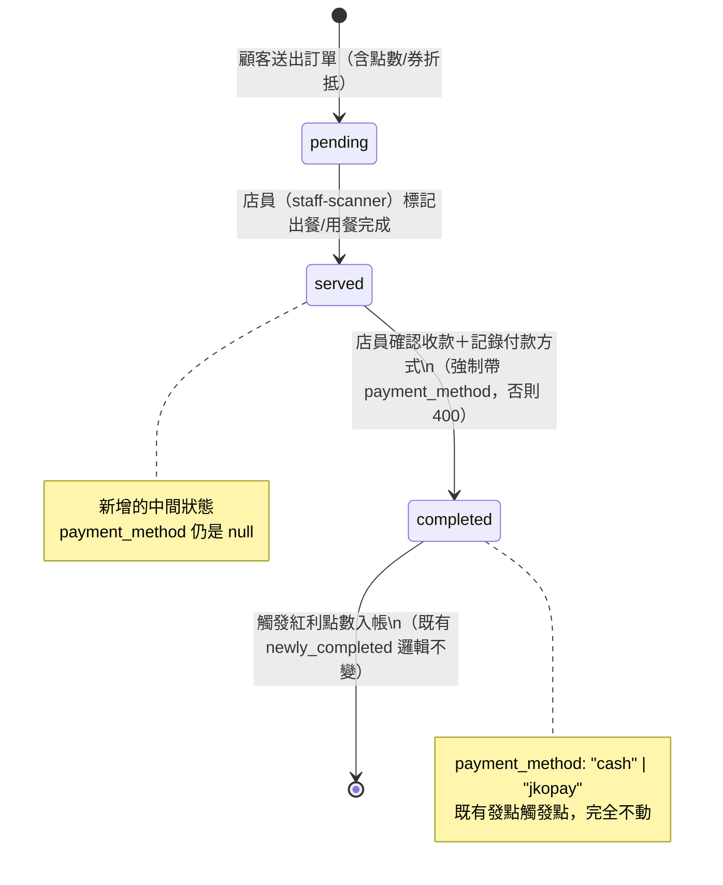

# Plan: 堂食訂單付款/核銷流程（mynotification 端）

## Goal
現有堂食點餐流程（`app/dine-in/*`、`DineInOrder`）的 `completed` 狀態，目前同時代表「出餐/用餐完成」「已收款」「觸發紅利點數入帳」三件事疊在同一次店員按鈕點擊上，沒有正式的收款步驟、也沒有付款方式（現金/街口支付）記錄。這次要把「已收款」正式獨立出來：顧客用餐完畢後，店員在 staff-scanner 依訂單金額（`total_amount`，已含點餐當下套用的點數/優惠券折抵，付款步驟不重新選點數/券）確認收款、記錄付款方式，確認收款後才核銷訂單狀態、觸發顧客紅利點數入帳。

跟已上線的「會員條碼＋門市收銀」（`plan-member-code-checkout.md`）是**兩套並存機制**，服務不同情境：門市收銀處理完全沒有 App 訂單紀錄的實體消費（店員手動輸入金額），這個功能處理已經在 App 內點餐、有 `DineInOrder` 訂單號的情況（金額由訂單決定，不是手動輸入）。兩者不合併、不互相取代。

**這份 plan.md 只涵蓋 mynotification（顧客 App）這一側**：被動顯示新狀態／付款方式，沒有新的顧客操作。狀態轉換由店員在 staff-scanner 觸發（`PATCH /dine-in-orders/{id}/status`），畫面設計由 `staff-scanner` session 自己的實作負責；後端欄位/端點由 `back-end` session 自己的實作負責。三方已透過跨 session 訊息討論定案，見下方「已定案」。

Done 的定義：顧客的「我的點餐」列表與訂單詳情頁能正確顯示三種狀態（處理中/已出餐待收款/已完成）與付款方式；`served→completed` 轉換後顧客能在紅利點數明細看到正確入帳。

## Architecture / flow



```mermaid
sequenceDiagram
    participant C as 顧客（mynotification）
    participant S as staff-scanner
    participant B as Backend

    C->>B: POST /dine-in-orders（含 use_points/coupon_id）
    B-->>C: DineInOrder(status=pending)
    S->>B: PATCH /dine-in-orders/{id}/status {status:"served"}
    B-->>S: 200
    S->>B: PATCH /dine-in-orders/{id}/status {status:"completed", payment_method:"cash"}
    B-->>S: 200（觸發 loyalty_service.earn_points）
    B--)C: （既有推播/輪詢機制）通知點數入帳
    C->>C: app/points.tsx、我的點餐列表顯示最新狀態/付款方式

    style C fill:#dff0d8,stroke:#3c763d
```

## Scope（mynotification 這個 repo）

### May modify
- `types/dineIn.ts` — `DineInOrderStatus` 新增 `'served'`；`DINE_IN_ORDER_STATUS_LABEL` 補上對應文案；`DineInOrder` 介面新增 `payment_method: 'cash' | 'jkopay' | null`
- `app/(drawer)/(tabs)/coupons.tsx` — `DINE_IN_FILTER_TABS` 新增 `served` 篩選標籤（比照既有 `ORDER_FILTER_TABS` 的寫法）
- `app/dine-in/order/[id].tsx` — 有 `payment_method` 時顯示付款方式文字

### Must not modify
- `app/dine-in/menu.tsx`／`cart.tsx`／`confirm.tsx`／`restaurant.tsx`／`table.tsx`（點餐流程本身不變，折抵邏輯維持在點餐當下）
- `store/useDineInOrderStore.ts`
- `services/dineIn.ts`（mynotification 不呼叫狀態轉換端點，那是店員操作）
- `app/member-code.tsx`、`services/loyalty.ts` 的 `generateMemberCode`、`types/storeCheckout.ts`（會員條碼＋門市收銀功能，兩套並存不互相影響）
- `staff-scanner`／`back-end` repo（各自 session 自己的 plan 負責）

## Existing patterns to follow
- **狀態篩選標籤**：完全比照 `coupons.tsx` 既有的 `ORDER_FILTER_TABS`／`DINE_IN_FILTER_TABS` 寫法，新增一個 tab 即可，底線指示樣式/手勢左右切換的邏輯不用動
- **狀態顯示文字**：比照 `DINE_IN_ORDER_STATUS_LABEL` 現有寫法，新增一個 key
- **付款方式顯示**：比照 `app/points.tsx` 顯示交易類型圖示/文案的方式，簡單文字列即可，不需要圖示系統

## Constraints
- 折抵邏輯不變：點數/優惠券折抵維持在點餐送出當下（`submitDineInOrder` 的 `use_points`/`coupon_id`），付款步驟只是確認收款，不重新選點數/券
- 這次不做堂食訂單的取消/退款機制（「用餐完畢後沒付款就跑掉」的缺口本來就存在，這次不擴大範圍處理，見使用者確認）
- 現金／街口支付這次一樣只做「選項記錄」，不接真實金流 API（跟門市收銀那套一致）

## Verification
- 3 個端對端測試（需要 mynotification + staff-scanner 兩台裝置/模擬器同時操作）：
  1. **Happy path**：顧客點餐送出（含點數折抵）→ 店員標記「出餐/用餐完成」（served）→ 顧客「我的點餐」列表看到狀態變成「已出餐，待收款」→ 店員確認收款、選付款方式（completed）→ 顧客點數明細正確顯示這筆消費回饋、訂單詳情頁正確顯示付款方式
  2. **錯誤情境**：店員嘗試跳過 `served` 直接把 `pending` 標記成 `completed`，應該被拒絕（409）
  3. **錯誤情境**：店員標記 `completed` 時沒有帶 `payment_method`，應該被拒絕（400），訂單狀態不會被錯誤地推進
- 手動驗證：因跨兩個 App 操作，無法單靠 `tsc`/`lint` 驗證，需要實機測試
- Observability：沿用既有點數明細/我的點餐頁面顯示，若狀態顯示異常需能立即在畫面上發現（不會顯示成空白或錯誤文案）

## Done definition
- [ ] 3 個端對端測試通過（需等 staff-scanner／back-end 端完成對應功能才能真正測試）
- [ ] `npx tsc --noEmit`、`npm run lint` 乾淨
- [ ] `coupons.tsx` 的「我的點餐」列表、`dine-in/order/[id].tsx` 詳情頁都能正確顯示三種狀態與付款方式
- [ ] 既有「點餐時點數/優惠券折抵」「網購/門市收銀」功能行為不受影響（回歸測試）
- [ ] PR/commit 說明標註 AI 協作

## Risks & rollback
- **Risk**：`served`/`completed` 的狀態文案要是設計得不夠直覺，顧客可能誤解「已出餐」跟「已完成」的差異
  - Rollback：文案可以隨時調整（純前端字串），不影響資料或 API 契約
- **Risk**：三方（mynotification/back-end/staff-scanner）任一邊延遲會卡住端對端測試
  - Rollback：mynotification 這側（型別/篩選標籤/詳情頁顯示）可以獨立完成，不需要等對方就緒才能寫

## 已定案（跨 session 2026-09-16 討論定案）
- **狀態設計**：back-end 明確建議「方案 A」——新增中間狀態 `served`，`completed` 維持終點狀態不變。理由：既有發點觸發邏輯 `newly_completed = payload.status == "completed" and order.status != "completed"` 判斷的是「還不是 completed」而非「一定要從 pending 轉來」，所以插入 `served` 完全不影響這段已上線測試過的邏輯；且避免 `completed` 這個值在新舊資料裡代表不同語意的認知負擔（方案 B 是把 `completed` 改成「出餐完成」、另開 `paid` 代表收款，會讓舊資料的 `completed` 跟新資料意思對不起來）
- **後端欄位**：`DineInOrder.status` 合法值擴大為 `pending`／`served`／`completed`（自由字串，無 DB enum，同現有慣例）；新增 `payment_method`（String, nullable，`"cash"`/`"jkopay"`，收款前為 `null`，命名/型別比照剛上線的 `StoreCheckout.payment_method`）
- **狀態轉換限制**：嚴格照順序（`pending→served` 只能從 `pending`，`served→completed` 只能從 `served`，跳過會 409，比照現有 `Order.status` 的 `paid→shipped` 限定慣例）；轉到 `completed` 強制要求帶 `payment_method`（沒帶回 `400`）
- **staff-scanner 互動設計**：不另開新畫面，在既有 `orders.tsx` 訂單卡片上比照 `products.tsx`/`menu-items.tsx` 的「點一下展開內嵌面板」模式——把「已完成」按鈕改成先展開付款方式選擇面板（現金/街口支付，沿用 `store-checkout.tsx` 的 chip 選擇 UI），選完按「確認收款」才送出。`orders.tsx` 現況是純列表點選（`status=pending` 的訂單 FIFO 排序顯示，不需要掃碼——堂食訂單本身已經有訂單號跟身份綁定）
- **不做的部分**：這次不新增堂食訂單的取消/退款端點（跑單情境的點數/優惠券退還缺口本來就存在，這次不擴大範圍，使用者已確認）

## Open questions
- 三支/兩支端點（`served`／`completed` 轉換）的最終 PATCH 回應格式細節、`payment_method` 是否要在 `served` 轉換時也允許帶（設計上不需要，但要不要後端直接忽略還是拒絕），待 back-end 實作時確認
- `served` 狀態的中文文案（「已出餐，待收款」還是其他措辭）可以在實作時微調，不影響架構
