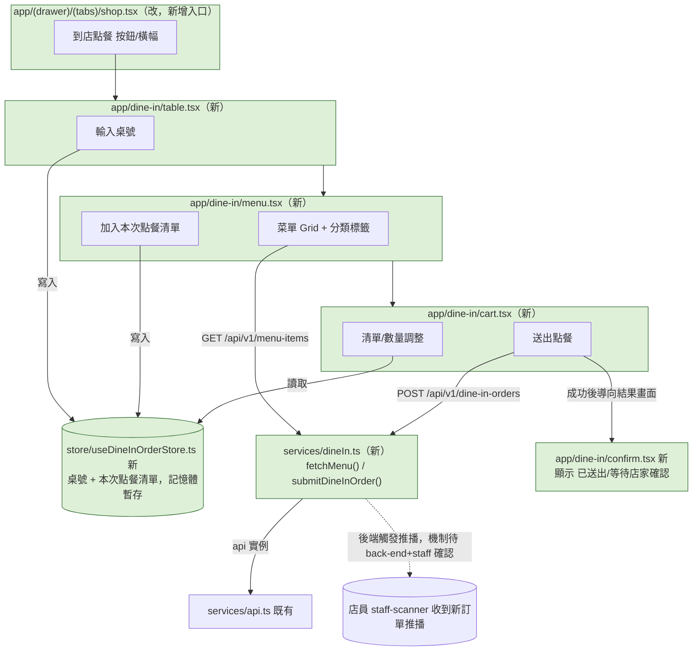

# Plan: 堂食點餐（到店自助點餐）

## Goal
顧客到店後用 `mynotification` 自助點餐（類似餐廳堂食點餐），流程：選/輸入桌號 → 瀏覽菜單（跟現有 194 筆網購商店商品完全分開）→ 加入本次點餐清單 → 送出訂單（狀態類似現有商店訂單的 `pending`，這次同樣不做金流）。送出後，店員端（`staff-scanner`，由另一個 Claude Code session `staff`負責，安裝在 HTC 測試機的 development build 上）要能即時收到推播通知，知道有新訂單要備餐。完成的定義：顧客能完整跑完選桌號→點餐→送出的流程並看到「已送出，等待店家確認」的結果畫面；店員端能透過推播得知新訂單（此部分實際驗證要等 `staff` 那邊的接單畫面就緒）。跟現有的「網購商店」（`shop.tsx`／`useCartStore`／`services/shop.ts`）完全獨立、不共用商品資料與購物車。

**本 plan 橫跨三個 Claude Code session（`front-end`本身／`back-end`／`staff`），front-end 這邊只負責 mynotification 的前端串接，後端資源與店員接單畫面由對方 session 各自實作，見下方「跨 Session 依賴」。**

## 跨 Session 依賴（back-end / staff）— 2026-09-06 已確認/待確認事項

已跟 `back-end` 確認（2026-09-06）：
- 菜單走獨立的 `MenuItem` 資源（`name`／`description`／`price`／`category`／`image_url`／`is_available`），**不含 stock**（賣完由店員手動關閉 `is_available`，不做原子扣庫存）。公開端點 `GET /api/v1/menu-items`（可加 `?category=` 篩選），比照既有 `products.py` 寫法。
- 訂單走獨立資源，**不**在現有 `Order`/`OrderItem` 上加 `order_type` 硬塞（理由：現有 `Order` 圍繞 ECPay 金流設計、`OrderItem.product_id` 是 FK 指向 `Product`，堂食狀態機也跟網購不同）。新增 `POST /api/v1/dine-in-orders`，`DineInOrder`（含 `table_number`）+ `DineInOrderItem`（`menu_item_id` + `quantity` + `unit_price` 價格快照，比照現有 `OrderItem` 的快照做法）。

**角色/推播設計已定案（2026-09-06，back-end + staff 對齊完畢）：**
- `staff-scanner` 的登入方式確認是「店員個人帳密登入」，跟顧客端共用 `/api/v1/login/access-token`，目前是同一張 `User` 表、完全沒有身份區分。
- 設計方向：`User` 加 `role` 欄位（`customer`/`staff`，預設 `customer`）；`PushToken` 表不用改，推播堂食新訂單時篩 `role="staff"` 底下的 token。
- **順便補上的安全缺口**：`staff` 確認 `coupons/redeem` 目前是他們唯一在用的核銷端點，且完全沒有身份檢查（任何登入成功帳號都能核銷任何人的優惠券）。這次補 `role` 機制時，`back-end` 會一併在 `coupons/redeem` 加上「必須是 staff 角色」的檢查，堵上這個已知缺口（詳見專案記憶 `redeem_code_contract`）。
- `staff-scanner` 的登入流程後續可能要跟著調整（login response 或後續 API 要能帶出 `role`），這塊 `staff` 那邊會配合，`back-end` 落地後互相通知。
- **仍待確認**：店員端「接單/訂單列表」畫面——`staff` 明確表示這是他們要另開的新功能，範圍要先跟他們的使用者確認優先順序，**不是「我們推播過去、他們就會自動顯示」**，目前完全沒有畫面/狀態管理/後端串接。如果我們想先假設一個資料格式讓對方之後對接，`staff` 建議至少帶：`order_id`／`table_number`／`items`（品項名稱+數量，不需要單價明細）／`submitted_at`／可能的備註欄位；不需要顧客姓名/電話等個資。

**本 plan 的前端 UI／流程可以先動工**（菜單瀏覽、選桌號、購物清單、送出訂單的畫面與互動邏輯），但「送出訂單」串接真實 `POST /api/v1/dine-in-orders` 端點、以及「店員即時收到推播」這兩個 Done definition 項目要等對方端點/機制就緒才能完整驗證。

## Architecture / flow

## Scope

### May modify（僅 mynotification，本 session 負責）
- `services/dineIn.ts`（新）— `fetchMenu()`／`submitDineInOrder(tableNumber, items)`，透過既有 `services/api.ts` 的 `api` 實例呼叫
- `types/dineIn.ts`（新）— `MenuItem`／`DineInOrder`／`DineInOrderItem` 型別，對齊 `back-end` 確認的欄位
- `store/useDineInOrderStore.ts`（新）— 桌號 + 本次點餐清單的暫存 state（**不用 `persist`/SecureStore**——理由：這是「單次到店」情境，不需要跨 App 重啟或跨裝置保留，離開流程或送出後應該清空，比照普通 Zustand store 即可，不比照 `useCartStore.ts` 的持久化寫法）
- `app/dine-in/table.tsx`（新）— 輸入桌號畫面
- `app/dine-in/menu.tsx`（新）— 菜單 Grid + 分類標籤，加入點餐清單
- `app/dine-in/cart.tsx`（新）— 本次點餐清單，可調整數量/移除，送出訂單
- `app/dine-in/confirm.tsx`（新）— 送出成功結果畫面（顯示「已送出，等待店家確認」，比照現有商店訂單「不做 ECPay 導轉」的誠實文案原則）
- `app/(drawer)/(tabs)/shop.tsx`（改）— 在既有的搜尋列/分類標籤上方新增一個「到店點餐」入口橫幅或按鈕，導到 `app/dine-in/table.tsx`
- `app/_layout.tsx`（改）— 在 `Stack.Protected guard={!!userToken}` 區塊新增 4 個 `Stack.Screen`（`dine-in/table`／`dine-in/menu`／`dine-in/cart`／`dine-in/confirm`，都 `headerShown: true` + `headerBackTitle: '返回'`，比照現有 `shop/[id]`／`cart` 的寫法）

### Must not modify
- `services/shop.ts`、`store/useCartStore.ts`、`app/shop/[id].tsx`、`app/cart.tsx`、`app/order/[id].tsx` — 既有網購商店流程，刻意保持獨立、不共用商品資料/購物車/訂單邏輯
- `app/coupon/[id].tsx` 的核銷邏輯 — 角色機制補上後如果要解掉核銷擁有者驗證的缺口，屬於另一個獨立 plan，這次不動
- `app/(drawer)/(tabs)/home.tsx` 的 `QUICK_ACTIONS`（8 格已滿）— 這次入口刻意放在 `shop.tsx` 裡，不擠進首頁 Grid

### 不在本 session 範圍內（由對方 session 實作，這裡只記錄依賴）
- `back-end`：`MenuItem`／`DineInOrder`／`DineInOrderItem` 資料模型與端點、店員角色與推播機制
- `staff`：`staff-scanner` 接收新訂單推播後的接單/訂單列表畫面

## Existing patterns to follow
- **列表 + 篩選**：分類標籤沿用 `app/(drawer)/(tabs)/shop.tsx` 的樣式與本機過濾邏輯（一次抓全部本機過濾）。**清單本身刻意不用 `FlashList`**——2026-09-06 實機測試發現 `FlashList` v2 在筆數很少時（菜單測試資料只有 4 筆）會有 grid 版面計算異常（分類列下方一大塊空白、卡片被推到畫面下方），菜單資料量遠小於商店的 194 筆商品、不需要虛擬清單處理效能，`app/dine-in/menu.tsx` 改用一般 `ScrollView` + `flexWrap` 排版，順利避開問題。實機測試過程中還踩到兩個延伸問題並修正：(1) 分類標籤原本是跟主要內容並排的兩個獨立 ScrollView（一水平一垂直），在 Android 上會讓垂直那個內容位置計算異常，改成分類標籤當作主 ScrollView 內部的第一個子元素、跟內容同屬一個可捲動區域；(2) 卡片寬度原本用 `Dimensions` 算固定像素寬度（`(容器寬度-間距)/欄數`），捨入誤差會讓 Yoga 排版引擎把第二欄擠到下一列變成非預期單欄排版，改用百分比寬度（`'48%'` + `justifyContent:'space-between'`）徹底避開
- **清單/購物車頁**：比照 `app/cart.tsx` 的品項調整數量/移除/送出邏輯
- **成功/失敗提示**：比照 `app/coupon/[id].tsx`、`app/cart.tsx` 的 `Alert.alert` 寫法
- **主題**：所有新畫面用 `useThemeColors()` + `useMemo(() => createStyles(colors), [colors])`
- **圖片**：一律用 `expo-image` 的 `Image`
- **API 呼叫**：一律從 `services/api.ts` 匯入共用的 `api` 實例

## Constraints
- 不做金流：堂食訂單這次也只到「已送出/pending」狀態，文案要誠實（例如「送出點餐」而非「送出並付款」），比照 `plan.md`（商店功能）已經確立的原則
- 不新增第三方套件
- 桌號輸入先用簡單文字輸入框（純文字比對，不做格式驗證），除非之後店家告知有固定桌號清單/QR 桌牌掃碼定位，屆時再開新 plan 調整
- `services/dineIn.ts` 的端點路徑在 `back-end` 實際部署 `/api/v1/menu-items`／`/api/v1/dine-in-orders` 前，先用這兩個確認過的路徑名稱直接寫，不用 TODO 佔位（已跟 `back-end` 對齊路徑設計方向，只是尚未部署）

## Verification
- 3 個端對端測試（需要 `back-end` 的 `/menu-items`、`/dine-in-orders` 端點就緒才能完整跑）：
  1. Happy path：進商店分頁按「到店點餐」→ 輸入桌號 → 瀏覽菜單、切分類確認篩選正確 → 加 2 樣品項到點餐清單 → 進清單頁調整其中一項數量 → 送出點餐 → 顯示「已送出，等待店家確認」→（若 `staff` 端已就緒）在 HTC 測試機的 `staff-scanner` 上看到這筆新訂單推播
  2. 錯誤案例：桌號欄位空白時「下一步」按鈕 disabled 或提示「請輸入桌號」，不能跳過桌號直接進菜單
  3. 錯誤案例：點餐清單是空的時候，「送出點餐」按鈕 disabled 或提示「請先加入品項」，不會送出空 items 請求
- 手動驗證：實機淺色/深色模式各跑一次 Happy path；中途離開點餐流程（例如按返回或切到其他 Tab）後，`useDineInOrderStore` 的暫存內容應該清空，不會殘留上一次的桌號/品項污染下一次點餐
- 不涉及長時間執行流程，不需要額外的 stress test

## Done definition
- [ ] 商店分頁新增「到店點餐」入口
- [ ] 選桌號 → 瀏覽菜單（分類篩選）→ 加入清單 → 調整清單 → 送出，全流程 UI 可操作（可先用假資料開發，不等後端）
- [ ] 串接真實 `GET /api/v1/menu-items`／`POST /api/v1/dine-in-orders`（**依賴 back-end 部署進度**）
- [ ] 送出成功後顯示誠實的「已送出/等待店家確認」文案，不誤導成已完成備餐
- [ ] 3 個端對端測試都通過（**依賴 back-end 端點就緒**）
- [ ] 店員端能收到新訂單推播並在 `staff-scanner` 看到（**依賴 back-end 推播機制 + staff 接單畫面，本 session 無法獨立驗證，需與對方 session 協同測試**）
- [ ] 既有網購商店（`shop.tsx`／`cart.tsx`／`order/[id].tsx`）流程完全沒被改動
- [ ] PR/commit 說明正確標示 AI 協作

## Risks & rollback
- 風險：`back-end` 的 `MenuItem`/`DineInOrder` 尚未部署，前端如果先串接真實端點會直接失敗——建議前端先用假資料/mock 開發 UI 互動邏輯，待對方端點就緒再切換成真實 API（一行改 `services/dineIn.ts` 裡的 fetch 邏輯即可，不影響畫面元件）
- 風險：店員角色/推播機制尚未定案，「送出訂單後店員怎麼知道」這件事目前無法完整驗證，Done definition 已明確標注此依賴，不會誤報為「完成」
- 風險：桌號目前只是自由輸入文字，沒有跟實體桌牌或門市系統核對，可能打錯字——現階段先接受，比照優惠券核銷碼一樣先求「流程通」，正確性驗證交給店員人工核對
- Rollback：全部是新檔案 + 2 處小範圍修改（`shop.tsx` 加入口按鈕、根 `_layout.tsx` 加 4 個 Stack.Screen），`git diff`／還原這兩個檔案即可完整回退

## 2026-09-06 追加：「我的點餐」歷史記錄查詢

原本的 Scope 漏掉了一件事：顧客送出點餐後，`confirm.tsx` 顯示完「已送出」就沒有任何地方可以再查這筆記錄——`back-end` 其實已經做好 `GET /api/v1/dine-in-orders/me`，但前端一直沒有畫面去呼叫它。補上：

- `services/dineIn.ts`（改）— 新增 `fetchMyDineInOrders()`
- `types/dineIn.ts`（改）— 新增 `DINE_IN_ORDER_STATUS_LABEL`（比照 `types/shop.ts` 的 `ORDER_STATUS_LABEL` 寫法）
- `app/(drawer)/(tabs)/coupons.tsx`（改）— 區段切換從「優惠券／我的訂單／我的收藏」3 個 Pill 變成 4 個，新增「我的點餐」，串 `['my-dine-in-orders']`（`enabled: section === 'dineInOrders'`，比照既有「我的訂單」的懶載入寫法）
- `app/dine-in/order/[id].tsx`（新）— 點餐詳情頁，沿用 `['my-dine-in-orders']` 快取（比照 `app/order/[id].tsx` 沿用 `['my-orders']` 快取的做法），不是複用同一支詳情頁（資料形狀不同：`table_number` vs `merchant_trade_no`、品項是 `menu_item_id` 不是 `product_id`）
- `app/dine-in/cart.tsx`（改）— 送出成功後 `queryClient.invalidateQueries({queryKey:['my-dine-in-orders']})`，比照 `app/cart.tsx` 送出網購訂單後 invalidate `['my-orders']` 的做法
- `app/_layout.tsx`（改）— 新增 `dine-in/order/[id]` 的 `Stack.Screen`

**已知風險**：`sectionSwitchRow` 從 3 個 Pill 變成 4 個（優惠券／我的訂單／我的點餐／我的收藏），小螢幕上文字可能擠壓，需要實機確認排版，必要時縮小字級或改成可橫向捲動。

## 2026-09-06 追加：桌牌 QR Code 直接帶入桌號

顧客到店除了手動輸入桌號，也支援用手機內建的相機/QR 掃描器掃桌上的 QR Code 直接帶入桌號、跳過手動輸入這一步：

- 桌牌 QR Code 內容是 `mynotification://dine-in/table?table=A3` 這種 deep link——因為 `app.json` 的 `scheme` 已經是 `mynotification`，Expo Router 會自動把這個 URL 導到 `app/dine-in/table.tsx`，**不需要任何額外的原生設定或新套件**，手機系統相機/Google Lens 等 QR 掃描器掃到後會直接跳出「用 mynotification 開啟」的提示（已安裝的情況下）。
- `app/dine-in/table.tsx`（改）：用 `useLocalSearchParams<{ table?: string }>()` 讀 `table` 參數，有值就直接 `setTableNumber()` + `router.replace('/dine-in/menu')`（顯示短暫的載入畫面，不閃現手動輸入表單）；沒有帶參數時（從商店分頁「到店點餐」手動進來）維持原本清空 store + 顯示輸入表單的行為，兩種入口共用同一支畫面。
- **已知限制，跟現有其他需要登入的 deep link（例如優惠券詳情頁）一致**：`dine-in/table` 是 `app/_layout.tsx` 裡 `Stack.Protected guard={!!userToken}` 保護的畫面，如果顧客掃碼當下還沒登入，會先卡在登入畫面、桌號參數遺失，需要重新掃碼——沒有做「登入後自動導回原本的 deep link」機制，這次也不打算補（範圍外，之後如果要做建議跟優惠券的情況一起處理，不要只做點餐這一個）。
- 桌牌 QR Code 本身（實體印製、每桌對應唯一桌號的網址）是店家/營運端的工作，不在前端程式碼範圍內。

## Open questions
- 店員角色/認證設計與推播機制——待 `back-end` 與 `staff` 協調後補上具體設計（`back-end` 已主動去問 `staff`，回覆後會同步）
- 店員端要不要自己做「接單/訂單列表」畫面，或需要 front-end 這邊先假設一個資料格式給 `staff` 對接——待 `staff` 回覆
- 桌號要不要有效性檢查（例如跟門市既有桌號清單比對）——目前先當作自由文字輸入，不做檢查，等實際使用回饋再看要不要加
