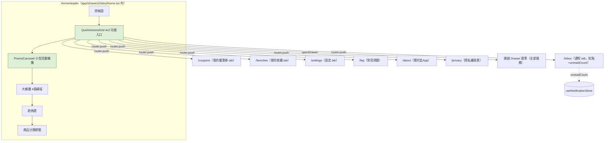

# Plan: 首頁新增「功能 Grid」與「小型活動輪播」區塊

## Goal
使用者參考一款支付類 App 的首頁截圖，希望在 `mynotification` 首頁（`app/(drawer)/(tabs)/home.tsx`）新增兩個區塊：一個 4x2（8 格）的功能捷徑 Grid，以及一個矮版的活動小輪播。目的是讓使用者從首頁能快速跳到 App 內既有的次要功能頁（優惠券、收藏、通知、設定、常見問題等），並展示一個獨立於現有大輪播、留給行銷活動使用的小型輪播區。完成的定義：兩個新區塊出現在首頁「問候語」之後、「大輪播」之前，樣式與現有 MUJI 風配色一致；功能 Grid 的 8 個入口全部可點擊並導向 App 內對應的既有畫面（不是假連結）；小輪播為純前端假資料展示，之後若要接後端活動資料再另外規劃 API。

## Architecture / flow

## Scope

### May modify
- `app/(drawer)/(tabs)/home.tsx`（唯一需要改動的檔案：新增 `QUICK_ACTIONS`/`PROMO_BANNERS` 常數、`QuickActionsGrid`/`PromoCarousel` 兩個區域性元件、對應 styles，插入 `HomeHeader` 內）

### Must not modify
- `services/products.ts`、`store/*`、`services/api.ts`
- 其他分頁畫面（`coupons.tsx`／`favorites.tsx`／`inbox.tsx`／`settings.tsx`／`faq.tsx`／`about.tsx`／`privacy.tsx`）——功能 Grid 只是導航過去，不改動目的頁面本身
- `app/(drawer)/_layout.tsx`、`app/(drawer)/(tabs)/_layout.tsx`（不動 Drawer/Tab 導航結構本身）

## Existing patterns to follow
- 比照 `home.tsx` 現有 `Marquee`／`ProductRecommendations` 的寫法：區域性 function component 定義在同一檔案內，`styles` 統一加進檔案底部的 `StyleSheet.create`
- 區塊標題比照現有 `sectionTitleRow`/`sectionAccentBar`/`sectionTitle` 樣式（左側色塊 + 標題文字），維持視覺一致
- 小輪播沿用現有大輪播 `react-native-reanimated-carousel` 的 `Carousel` 元件與 `dotsRow`/`dot`/`dotActive` 分頁指示器樣式，只是縮小高度、換一組獨立的假資料（不與大輪播共用 `BANNER_COPY`/`fetchBannerImages`）
- 功能 Grid 導航一律用 `expo-router` 的 `router.push('/xxx')`（不含路由群組前綴），比照 `settings.tsx:193` 的 `router.push('/coupons')` 寫法
- 通知入口的紅點數字直接讀 `useNotificationStore` 的 `unreadCount`（現有 tab bar 徽章已經是這個 store 提供，不另外造假資料）
- 開啟 Drawer 選單用 `useNavigation()` + `DrawerActions.openDrawer()`（`@react-navigation/native`），對應「全部服務」入口

## Constraints
- 不新增第三方套件（輪播、圖示都用專案已有的 `react-native-reanimated-carousel`／`@expo/vector-icons`）
- 只改 `home.tsx` 一個檔案，不動其他畫面或後端
- 8 個功能入口全部要是真實可導航的連結，不能是假的佔位符
- 維持 MUJI 風配色（大地色/木質色系），不要引入截圖裡的紅色系配色

## Verification
- 3 個端對端測試（皆為手動操作，肉眼確認）：
  1. Happy path：登入後進首頁，看到「問候語」下方依序出現 4x2 功能 Grid、小輪播、大輪播；點擊 Grid 裡「我的優惠券」，確認畫面切到優惠券分頁
  2. 通知紅點：在通知分頁把某則通知標成已讀（減少 unreadCount），回首頁確認 Grid 上「通知中心」的紅點數字有同步更新
  3. 小輪播捲動：手動左右滑動小輪播，確認能自動輪播、手動滑動不卡頓，分頁小圓點跟著目前頁數變化
- 手動驗證：在實機（Android Dev Client）用今天剛修好的畫面截圖比對，確認深色狀態列圖示、新區塊間距、字型（Noto Sans TC）都正常
- 不涉及非同步/長時間執行流程，不需要額外的 stress test

## Done definition
- [ ] 4x2 功能 Grid 與小輪播都插入 `HomeHeader`，位置在問候語之後、大輪播之前
- [ ] 8 個功能入口全部可點擊並正確導航（含開啟 Drawer 的「全部服務」）
- [ ] 通知入口紅點數字與 `useNotificationStore.unreadCount` 同步
- [ ] 小輪播用純前端假資料，樣式跟 MUJI 風配色一致
- [ ] 只改動 `app/(drawer)/(tabs)/home.tsx`
- [ ] PR/commit 說明正確標示 AI 協作

## Risks & rollback
- 風險：8 個入口塞進單一 `home.tsx` 檔案，長期會讓這支檔案愈來愈肥大——目前先跟隨現有「全部寫在 home.tsx」的專案慣例，若之後入口數量再增加，建議抽成獨立的 `components/home/QuickActionsGrid.tsx`
- 風險：`DrawerActions.openDrawer()` 若拿到的 `navigation` 物件不在 Drawer context 內會噴錯——需要在實機測試確認 home.tsx 掛在 `(drawer)/(tabs)` 底下能正確拿到 Drawer navigation
- Rollback：改動集中在單一檔案，`git diff`/`git checkout -- app/(drawer)/(tabs)/home.tsx` 即可完整還原

## Open questions
- 三個確認問題使用者都已選擇推薦選項：位置在問候語之後大輪播之前、Grid 用電商情境真實入口、小輪播用純假資料
- 小輪播（甚至功能 Grid）的內容之後是否要改由後端資料庫驅動（營運可控的坑位設計），而非寫死在前端？初步構想：
  - 小輪播：後端一張通用 banner/promotion 表，欄位約為 `title`／`subtitle`／`image_url`／`link_target`／`sort_order`／`start_at`／`end_at`／`is_active`，API 回傳依排序、且在有效期內的清單，前端純渲染
  - 功能 Grid：本質上較像導航設定而非行銷內容，多數入口可以先寫死；若要支援活動期間動態增減入口，可比照 banner 表再加 `icon_name`／`badge_type`（none/dot/N/count）欄位
  - 這一版先維持純前端假資料（見 Constraints），等版面定案、真的有動態更新內容的需求時，再跟 `back-end` session 討論 schema 與 API 契約
