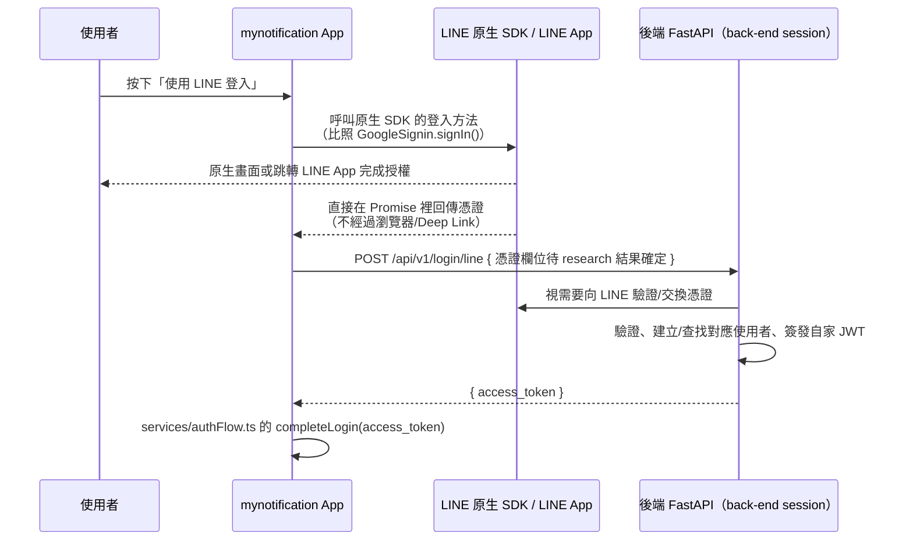

# Plan: LINE 登入改用原生 SDK（取代瀏覽器版 OAuth）

## 背景（給新 session 的前情提要）

LINE 第三方登入已經用「瀏覽器版 OAuth」（`expo-web-browser` + Deep Link 中繼落地頁）做出來、測試通過、可以正常登入了。完整的實作過程、架構圖、跟後端的契約，都記錄在同一個目錄下的 **`plan-line-login.md`**（這份文件的前身），裡面的「除錯回顧」章節記錄了 5 個踩過的坑，強烈建議開工前先讀過一遍，尤其是最後兩個：

- 為什麼需要一支後端中繼落地頁（`GET /api/v1/login/line/redirect`）：LINE Console 的 Callback URL 只接受 `https://`，不接受 App 的自訂 scheme
- 登入成功後畫面會**閃一下登入頁再跳首頁**：這是這次要解決的殘留問題，根源是 Deep Link 轉跳回 App 這件事，會同時觸發「`WebBrowser.openAuthSessionAsync` 自己攔截」跟「Expo Router 自己的 Linking 系統也處理同一個網址」兩條平行路徑，兩次修法（立即導頁、延遲導頁）都沒有徹底解決，只是治標

## Goal

把 LINE 登入從「瀏覽器版 OAuth + Deep Link 中繼」，改成跟現有 **Google 登入**（`services/googleAuth.ts`，`@react-native-google-signin/google-signin`）同一種架構：原生 SDK 彈出 App 內部的原生畫面/跳轉 LINE App 完成授權，直接在 JS 呼叫堆疊裡拿到憑證，全程不經過瀏覽器、不需要任何 Deep Link 轉跳。完成的定義：使用者按「使用 LINE 登入」→ 原生流程完成 → 直接進首頁，**不會**再閃一下登入頁，且以下這些跟 Deep Link 相關的機制全部可以刪除：
- `app/redirect.tsx` 這支畫面
- `app/_layout.tsx` 裡 `<Stack.Screen name="redirect" />` 的註冊
- 後端的 `GET /api/v1/login/line/redirect` 中繼落地頁端點（跟 `back-end` session 協調移除或保留但不再使用）
- `EXPO_PUBLIC_LINE_REDIRECT_URI` 這個環境變數

## 為什麼現在改這個沒有額外代價

當初選瀏覽器版 OAuth（而不是原生 SDK）的理由是「原生 SDK 需要原生模組，Expo Go 測不了，還要一直等 EAS Build」。但這個理由**已經不成立**：這個專案本來就因為 Google 登入的原生模組，全程都要用 EAS Dev Client 測試（Expo Go 從來就用不了），所以 LINE 改用原生 SDK 不會多付出任何「原本沒有」的建置成本，卻能徹底避開整類 Deep Link 相關的 bug。

## 第一步：research（新 session 開工前務必先做）

LINE 官方目前對 React Native / Expo 的原生 SDK 支援方式可能有變動，開工前要先確認，不要照抄舊資訊：

1. 有沒有 LINE 官方維護、或社群維護且仍在活躍維護中的 React Native 套件（例如 `@xmartlabs/react-native-line`，但務必查證目前是否還在維護、支不支援目前的 Expo SDK 版本、有沒有現成的 Expo config plugin）
2. 該套件是否支援 **Expo config plugin**（不用自己手寫原生 iOS/Android 程式碼，比照 `@react-native-google-signin/google-signin` 在這個專案裡的整合方式）
3. 該套件回傳的憑證格式是什麼（id_token？access_token？authorization code？），會直接影響後端 `POST /api/v1/login/line` 的契約要不要跟著改

## Architecture / flow（目標架構，比照 Google 登入）

## Scope

### May modify
- `services/lineAuth.ts`（整個重寫，改用原生 SDK 的 API，角色定位不變：只負責拿憑證，不呼叫自家後端）
- `app/index.tsx` 的 `onLineLogin`（呼叫方式可能要調整，視新的 `signInWithLine()` 回傳格式而定；UI 按鈕、loading 狀態沿用現有的不用大改）
- `app.json`（新增原生 SDK 的 config plugin，比照 `@react-native-google-signin/google-signin` 那段寫法）
- `package.json`（新增原生 SDK 依賴，移除不再需要的 `expo-web-browser`/`expo-linking` 相關程式碼引用——但這兩個套件本身可能專案其他地方還有用到，移除前先確認）
- `.env`（移除 `EXPO_PUBLIC_LINE_REDIRECT_URI`，`EXPO_PUBLIC_LINE_CHANNEL_ID` 可能還需要、也可能要換成原生 SDK 要求的其他識別碼，視 SDK 而定）
- 刪除 `app/redirect.tsx`
- `app/_layout.tsx`（移除 `<Stack.Screen name="redirect" />` 這行）
- `CLAUDE.md`（LINE 登入相關的架構說明要整個換成原生 SDK 版本；`plan-line-login.md` 的除錯回顧可以保留當歷史紀錄，但要註明「已改為原生 SDK，以下是舊版瀏覽器 OAuth 的紀錄」）

### Must not modify
- `services/authFlow.ts` 的 `completeLogin()`
- `services/googleAuth.ts`、`app/magic-login.tsx`（其他登入方式，不動）
- 需要跟 `back-end` session 協調的部分：`POST /api/v1/login/line` 的契約如果因為憑證格式改變（例如從 authorization code 改成 id_token）需要跟著調整，**這件事要主動去問 back-end session**，不要自己假設

## Existing patterns to follow
- 整體結構完全比照 `services/googleAuth.ts`：`GoogleSignin.configure(...)` 在模組載入時設定一次、`signInWithGoogle()` 回傳 `string | null`（`null` 代表使用者取消，不視為錯誤）
- `app/index.tsx` 的 `onLineLogin` 錯誤處理/loading 狀態寫法不用大改，沿用現有的 `isLineSubmitting`

## Constraints
- 這次不需要後端的中繼落地頁，也不需要處理 Deep Link scheme 的斜線數量問題——這些複雜度應該整個消失
- LINE Console 的 Channel 設定要從 **Web app** 改成/新增 **Mobile app** 類型，需要填 Android package name（`com.stevenchouis.mynotification`，見 `app.json` 的 `android.package`）跟 iOS bundle ID（`com.stevenchouis.mynotification`，見 `app.json` 的 `ios.bundleIdentifier`）
- 改完一定要重新 `eas build --profile development --platform android` 才能測（新增原生模組），這點跟當初 Google 登入整合時一樣

## Verification
- 3 個端對端測試：
  1. Happy path：按「使用 LINE 登入」→ 原生流程完成 → **直接**進首頁，中間**不會**閃過登入頁
  2. 使用者中途取消：不視為錯誤，安靜返回登入頁（比照 Google 登入取消的行為）
  3. 同一組 LINE 帳號登出再登入一次，確認對應到同一個使用者
- 手動驗證：確認 `app/redirect.tsx` 刪除後，App 裡沒有任何地方還在引用它（`grep -rn "redirect" app/`），`app/_layout.tsx` 也沒有殘留的路由註冊

## Done definition
- [x] Research 完成，確認要用哪個原生 SDK 套件，並記錄下來（供之後維護參考）——`@xmartlabs/react-native-line` v6，詳見 CLAUDE.md 的 `services/lineAuth.ts` 說明
- [x] `services/lineAuth.ts` 改用原生 SDK，`app/redirect.tsx`／相關路由註冊／`EXPO_PUBLIC_LINE_REDIRECT_URI` 都已移除
- [x] LINE Console 的 Channel 設定改成 Mobile app 類型並填好 package name / bundle ID——使用者已在 Console 手動完成（Android Package name `com.stevenchouis.mynotification`、Package signature 用 `eas credentials` 查出的 EAS keystore SHA-1，實際值記錄在 CLAUDE.md）
- [x] 已跟 `back-end` session 確認並同步新的 `POST /api/v1/login/line` 契約（如果憑證格式有變）——已改成 `{ id_token }`（比照 Google 登入），後端送去 LINE `/oauth2/v2.1/verify` 驗證，已部署到 Render；`GET /api/v1/login/line/redirect` 中繼落地頁 back-end 決定先保留著（前端已用不到，放著沒有維運成本）
- [x] 重新 `eas build` 過，裝上新 Dev Client 後 LINE 登入原生模組正常運作，登入成功後改跳 Toast（不再閃登入頁）——測試過程中額外發現並修掉兩個周邊問題：`app/_layout.tsx` 的 `Stack.Protected` 用法錯誤造成的 console 警告狂洗、`app/magic-login.tsx` 在已登入狀態下被裝置殘留的舊 deep link 觸發、閃過錯誤畫面才到首頁。使用者確認「OK了」，但 3 個驗證測試（Happy path／中途取消／同帳號登出再登入）沒有逐項明確跑過，之後有機會建議補測
- [x] CLAUDE.md 更新成原生 SDK 版本的架構說明
- [x] PR/commit 說明正確標示 AI 協作——已 commit（`7b50bd1`）並 push 到 `https://github.com/stevenchouis/mynotification.git`

## Risks & rollback
- 風險：原生 SDK 套件可能維護狀態不理想（LINE 官方沒有直接維護 Expo 版 SDK，得依賴社群套件），如果 research 階段發現沒有可靠選項，要回來跟使用者討論是否維持現有瀏覽器版 OAuth（畢竟功能上已經是「能動」的狀態，只是有個閃畫面的小瑕疵）
- 風險：新增原生模組需要重新 EAS Build，過程中如果又卡住（參考 `plan-line-login.md` 除錯回顧的教訓），會拖時間
- Rollback：目前瀏覽器版 OAuth 的實作是完整且測試通過的，如果原生 SDK 這條路走不通，`git revert`/checkout 回瀏覽器版本即可，不會沒有能動的版本可用

## Open questions
- 用哪個原生 SDK 套件？留給新 session 的 research 步驟決定
- 後端的 `POST /api/v1/login/line` 契約要不要因為憑證格式改變而調整？要主動問 `back-end` session
