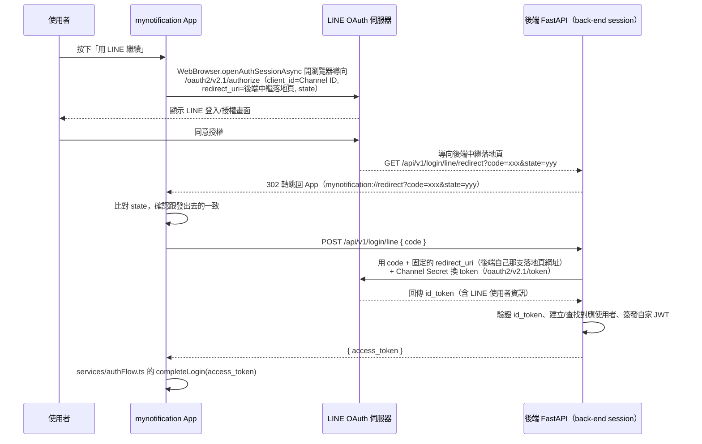

# Plan: LINE 第三方登入

## Goal
台灣使用者習慣用 LINE 帳號登入 App，勝過 Google（尤其是沒有 Gmail 習慣的族群）。這個功能要在既有登入畫面（`app/index.tsx`）新增第三方「用 LINE 繼續」按鈕，比照已經上線的 Google 登入、Magic Link 一樣，最終都收斂到共用的 `services/authFlow.ts` 的 `completeLogin(accessToken)` 收尾（存 Token、同步 Push Token、導向 `/home`）。完成的定義：使用者按下「用 LINE 繼續」→ 開啟系統瀏覽器跳到 LINE 官方登入/授權頁 → 授權完成自動跳回 App → 直接進入首頁，不需要輸入帳密。

## Architecture / flow

**為什麼多一個中繼落地頁**：LINE Developers Console 的 Callback URL 欄位只接受 `https://` 網址，不接受 `mynotification://` 這種自訂 scheme，所以不能像原本規劃的直接讓 LINE 導回 App。解法比照 `app/magic-login.tsx` 的 Magic Link 落地頁：LINE 先導到後端一支固定的 https 端點（`GET /api/v1/login/line/redirect`），這支端點什麼都不做，只是把收到的 `code`/`state`（或 `error`）原封不動 302 轉跳到 `mynotification://redirect?...`，App 端再用 `WebBrowser.openAuthSessionAsync` 攔截這個自訂 scheme。

## Scope

### May modify
- `app/index.tsx`（新增「用 LINE 繼續」按鈕與 `onLineLogin` 處理函式，比照 `onGoogleLogin` 的寫法）
- `services/lineAuth.ts`（新檔案：封裝 `expo-web-browser` + `expo-linking` 的 LINE OAuth 授權流程，回傳 `code`，比照 `services/googleAuth.ts` 的角色）
- `.env` / `.env.example`（新增 `EXPO_PUBLIC_LINE_CHANNEL_ID`、`EXPO_PUBLIC_LINE_REDIRECT_URI`）
- `CLAUDE.md`（功能完成後，把下面「LINE Developers Console 設定步驟」整理進「環境變數」章節，比照現有的 FCM V1 那段 step-by-step 寫法）

### Must not modify
- `services/authFlow.ts` 的 `completeLogin()` 本身（三種既有登入方式都依賴它，LINE 登入直接複用、不改動它的邏輯）
- `services/googleAuth.ts`、`app/magic-login.tsx`（既有登入方式，不動）
- 後端程式碼（不在這個 repo，新的 `POST /api/v1/login/line` 由 `back-end` session 負責，這裡只消費）

## Existing patterns to follow
- `onLineLogin` 的錯誤處理、loading 狀態（`isLineSubmitting`）比照 `app/index.tsx` 現有的 `onGoogleLogin`／`isGoogleSubmitting` 寫法
- `services/lineAuth.ts` 的角色定位比照 `services/googleAuth.ts`：只負責「跟第三方拿到憑證」，不負責呼叫自家後端 API（呼叫後端、`completeLogin()` 收尾都留在 `app/index.tsx`）
- App 端不需要像 `app/magic-login.tsx` 那樣另外開一個 deep link 落地畫面/路由：`WebBrowser.openAuthSessionAsync` 直接把攔截到的返回網址回傳給呼叫它的同一個函式（`services/lineAuth.ts` 的 `signInWithLine()`），在同一個 async function 裡就能解析出 `code`，不需要額外的路由/畫面。**但後端需要一支新的落地頁端點**（`GET /api/v1/login/line/redirect`），角色等同 `GET /login/magic-link/redirect`
- 這功能完成後，記得在 CLAUDE.md 補一段跟現有「Android 推播（FCM V1）」同樣風格的 step-by-step 設定文件（申請 LINE Developers 帳號、建立 Provider/Channel、拿 Channel ID/Secret、設定 Callback URL），這是使用者明確要求要留下的文件

## Constraints
- **Channel Secret 絕對不能放進前端**（`.env`、程式碼都不行）——這個值只能存在後端的環境變數，前端只需要 Channel ID（這個是公開的 OAuth client_id，跟 Google 登入的 `webClientId`同等級，可以放 `EXPO_PUBLIC_*`）
- 用 `expo-web-browser` + `expo-linking` 的 `Linking.createURL()` 產生 App scheme 網址，不用原生 LINE SDK，也**不用** `expo-auth-session`——這個套件內部的 PKCE 邏輯會牽動原生模組 `expo-crypto`（專案沒裝），一 import 就會在裝置上噴「Cannot find native module ExpoCrypto」，裝上去還要重新 EAS Build 才行；改用純 JS、已連結原生模組的 `expo-web-browser`/`expo-linking` 組合就能避開這個坑，避免重演 Google 登入那種「Expo Go 無法測試、每次都要等 EAS Build」的開發體感
- 傳給 LINE 的 `redirect_uri` 固定是後端部署在 Render 的中繼落地頁（`EXPO_PUBLIC_LINE_REDIRECT_URI=https://fastapi-pj-2.onrender.com/api/v1/login/line/redirect`），不論本機開發用的 `EXPO_PUBLIC_API_URL` 是不是區網 IP，這個值都要維持這支公開網址不變，因為它是註冊在 LINE Console 的固定值，前後端必須一字不差
- App 實際攔截的返回網址才是專案已有的 `mynotification://` scheme（`app.json` 已經設定好），不透過 Expo 的 auth proxy，減少一層轉導

## Verification
- 3 個端對端測試（手動操作，肉眼確認）：
  1. Happy path：登入頁按「用 LINE 繼續」→ 系統瀏覽器跳出 LINE 授權頁 → 同意 → 自動跳回 App → 直接進首頁，且首頁能看到自己的通知/收藏（代表 JWT 正確可用）
  2. 使用者在 LINE 授權頁按「取消」：跳回 App 後不應該顯示錯誤 Alert（跟 Google 登入取消的處理邏輯一致，靜默返回登入頁）
  3. 後端 `/login/line` 回傳錯誤（例如 code 過期或無效）：App 要顯示清楚的錯誤訊息（`error.response?.data?.detail`），不能整頁卡住或白屏
- 手動驗證：同一組 LINE 帳號登出再登入一次，確認對應到同一個使用者（不會每次登入都建一個新帳號）
- 不涉及長時間執行流程，不需要額外的 stress test

## Done definition
- [ ] 登入頁新增「用 LINE 繼續」按鈕，視覺跟既有 Google 登入按鈕同一組風格
- [ ] `services/lineAuth.ts` 封裝好 `expo-web-browser` + `expo-linking` 流程，回傳授權碼
- [ ] 已跟 `back-end` session 溝通並確認 `POST /api/v1/login/line` 的契約（body 格式、Channel Secret 存放位置）
- [ ] 三個驗證測試都通過
- [ ] CLAUDE.md 補上 LINE Developers Console 申請步驟的文件
- [ ] PR/commit 說明正確標示 AI 協作

## Risks & rollback
- 風險：LINE Login 要申請 Email 權限需要額外跟 LINE 官方申請審核（預設只有 `openid`/`profile`），如果後端需要使用者 Email 做帳號對應，這塊可能會卡審核時間——先確認後端是否一定需要 Email，或改用 LINE 的 `userId` 當唯一識別碼即可
- 風險：Channel Secret 流向後端而不是前端，代表這功能**前後端必須同步上線**，前端沒後端配合完全無法運作——先跟 `back-end` session 溝通排時程，避免前端先合併但功能整個是壞的
- Rollback：改動集中在 `app/index.tsx`（新增區塊）跟兩個新檔案（`services/lineAuth.ts`），`git diff`/刪除新檔案即可完整還原，不影響既有三種登入方式

## 除錯回顧（LINE 登入卡關的完整經過，留給以後參考）

> **已改為原生 SDK**：本文件記錄的是「瀏覽器版 OAuth + 後端中繼落地頁」的舊版實作，已依 `plan-line-login-native-sdk.md` 改用原生 SDK（`@xmartlabs/react-native-line`），`app/redirect.tsx`、`EXPO_PUBLIC_LINE_REDIRECT_URI`、後端的中繼落地頁都已不再使用。以下內容純粹留作歷史紀錄，之後若有類似的 Deep Link/瀏覽器 OAuth 整合，仍值得參考裡面踩過的坑。

功能整體測試通過，但過程中踩了三個各自獨立的坑，依序修好：

1. **Callback URL 只接受 https**：LINE Console 的 Callback URL 欄位不接受 `mynotification://` 自訂 scheme，只能填 https 網址。解法是加一個後端中繼落地頁（`GET /api/v1/login/line/redirect`），架構已寫在上面的 Architecture 區塊
2. **LINE App 內建瀏覽器不支援 HTTP 302 轉跳自訂 scheme**：落地頁一開始用純 302，LINE App 內建的 WebView 沒辦法正確處理轉跳到非 http(s) 的 scheme，導致卡住、同一個 code 被重複打。改成 HTML 頁面 + `<meta refresh>` + JS `location.replace()` + 備用可點擊連結三重保險解決
3. **自訂 scheme 的斜線數量**：`mynotification://redirect` 是兩個斜線，URL 標準解析下 `redirect` 會被當成主機名稱（host），不是路徑（path）；但 Expo Router 的檔案式路由（`app/redirect.tsx`）是用 path 去比對的，兩個斜線的寫法會讓 Expo Router 自己的 deep link 導航比對不到路由。改成三個斜線 `mynotification:///redirect`（`Linking.createURL('redirect', { isTripleSlashed: true })`）解決
4. **真正卡最久的坑，而且跟前後端程式碼都無關**：`POST /login/line` 一直回 400「LINE 登入驗證失敗」，一開始以為是後端跟 LINE 換 token 的邏輯有問題，來回查了 Render 的 log、redirect_uri 組成、部署時間點都查不出所以然。最後用暫時的除錯 log 印出前端實際打的網址，才發現 **VSCode 終端機 session 裡殘留了手動設定的 `$env:EXPO_PUBLIC_API_URL`**，蓋過了 `.env.local`/`.env.development` 這些檔案設定（`@expo/env` 套件的規則是「系統環境變數已存在時，不會被 `.env*` 檔案覆蓋」），導致 App 全程打的其實是本機 LAN 開發後端、不是 Render，而本機後端剛好也有實作 LINE 登入、也回傳一模一樣的錯誤訊息，才會一直誤判成後端邏輯錯誤。教訓：以後遇到「怎麼改都沒用」的環境變數問題，要優先確認終端機 session 本身有沒有殘留手動 `$env:` 設定，比懷疑程式碼邏輯更快找到問題
5. **登入成功後畫面會先閃一下登入頁再跳首頁**：`app/redirect.tsx`（純粹是給 Expo Router 自己的 Linking 系統一個對應得到的路由，避免顯示 Unmatched Route）跟 `services/lineAuth.ts` 的 `onLineLogin` 流程是兩條平行路徑，同時被同一個 Deep Link 觸發。`redirect.tsx` 原本一進畫面就立刻依當下的 `userToken` 導頁，但這時候 `onLineLogin` 那條（`completeLogin()` 中間還要等推播 Token 註冊等額外的網路請求，時間不固定）通常還沒跑完、token 還沒設定好，會先誤判成未登入導去登入頁，等真正的登入流程跑完才又跳一次 `/home`。試過改成延遲幾秒才導頁，但延遲多久都可能撲空（`completeLogin()` 花的時間不固定），還是會閃。最後改成**完全不自動導航**，只靜靜顯示 loading，讓 `completeLogin()` 自然接管畫面；等超過 `SHOW_MANUAL_BUTTON_AFTER_MS`（8 秒）都沒反應，才顯示一個手動按鈕讓使用者自己點擊返回登入頁，不用計時器搶著跳轉

## Open questions
- ~~後端要不要強制拿使用者 Email~~ **已解決**：`back-end` session 已實作完成並套用到 Supabase。不強制要 Email，`User` 新增 `line_id` 欄位當唯一識別碼（比照 Google 模式），`email` 允許 `null`；找帳號時先比對 `line_id`，找不到才嘗試用 email 合併既有帳號（若日後有拿到 email），都沒有就新建 `auth_provider="line"` 的帳號。不用等 LINE Email 權限審核就能先上線
- ~~`POST /api/v1/login/line` 的最終路徑/欄位命名~~ **已定案，但後來又改過一次**：LINE Console 的 Callback URL 只接受 https，發現這件事之後改成中繼落地頁架構（見上面 Architecture 區塊），契約簡化成 `POST /api/v1/login/line` body `{ code }`（不用再傳 `redirect_uri`，因為那個值現在是後端自己固定的），已經跟 `back-end` session 同步這個異動，等他們確認新端點 `GET /api/v1/login/line/redirect` 上線
- ~~後端的公開網域~~ **已取得**：`https://fastapi-pj-2.onrender.com`（Render 部署），LINE Console 的 Callback URL 填 `https://fastapi-pj-2.onrender.com/api/v1/login/line/redirect`，前端 `.env` 的 `EXPO_PUBLIC_LINE_REDIRECT_URI` 也已經填好同一個值
- **目前唯一卡住的事**：後端的 `LINE_CHANNEL_ID`／`LINE_CHANNEL_SECRET` 環境變數還是空的（呼叫會回 400），前端的 `.env` 的 `EXPO_PUBLIC_LINE_CHANNEL_ID` 也還是空的，而且後端的 `GET /api/v1/login/line/redirect` 這支新端點也還沒實作——需要實際去 LINE Developers Console 申請 Channel（見下面步驟）拿到 Channel ID，同時等 `back-end` session 把落地頁端點跟 Channel Secret 補上

---

## LINE Developers Console 設定步驟（給實際申請時參考，完成後要搬進 CLAUDE.md）

1. 前往 [LINE Developers Console](https://developers.line.biz/console/)，用 LINE 帳號登入
2. 如果還沒有 **Provider**（代表公司/服務的頂層帳號），先建立一個，名稱可以填公司或產品名稱（例如「寶雅電子商城」）
3. 在該 Provider 底下建立一個新 **Channel**，Channel 類型選 **LINE Login**
4. 填寫 Channel 基本資料：
   - Channel name：App 名稱（例如「寶雅電子商城」）
   - Channel description：簡短描述
   - Category / Subcategory：依實際業務選最接近的分類（例如零售/電商）
   - App icon：可先用現有的 App icon
5. 建立完成後，進入該 Channel 的設定頁，切到 **LINE Login** 分頁：
   - **App types**：勾選 **Web app**（因為是走瀏覽器 OAuth 流程，不是原生 LINE SDK）
   - **Callback URL**：填 `https://fastapi-pj-2.onrender.com/api/v1/login/line/redirect`（LINE 只接受 https 網址，不能填 App 的 `mynotification://` scheme；這個網址要跟後端 `GET /api/v1/login/line/redirect` 端點、前端 `.env` 的 `EXPO_PUBLIC_LINE_REDIRECT_URI` 三邊完全一致）
6. 切到 **Basic settings** 分頁，記下兩個關鍵值：
   - **Channel ID**：這個是公開值，之後會放進前端的 `EXPO_PUBLIC_LINE_CHANNEL_ID`
   - **Channel secret**：這個是機密值，**只能**交給 `back-end` session 放進後端的環境變數，絕對不能出現在前端程式碼或 `.env`
7. （選用）如果後端需要拿到使用者 Email：在 Channel 設定裡找「Email address permission」申請權限，LINE 官方會需要審核，這段時間無法取得 Email（先確認 Open questions 那項是否真的需要）
8. 把 Channel ID 交給前端（填進 `.env` 的 `EXPO_PUBLIC_LINE_CHANNEL_ID`），Channel secret 交給 `back-end` session（不要透過同一個管道/訊息一起傳，降低外洩風險）
9. 這個 Channel 預設是「測試中」狀態，僅供你自己的 LINE 帳號（開發者本人）登入測試，不需要額外送審就能開發驗證；要開放給所有使用者上線，才需要在 Console 裡走「Publish」流程
