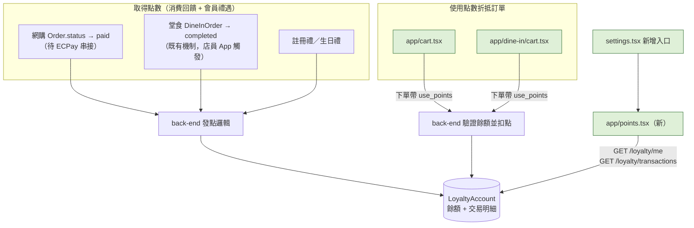

# Plan: 紅利點數（Loyalty Points）功能

## Goal

會員需要一個累積並使用的點數帳戶：① 透過**消費金額回饋**（網購訂單、堂食訂單皆計）與**會員禮遇**（註冊禮、生日禮）取得點數；② 在**網購購物車**或**堂食點餐清單**結帳時，用點數**折抵訂單金額**。完成的定義：新增「我的紅利點數」畫面顯示目前餘額與收支明細；結帳頁新增「使用點數折抵」欄位，送出訂單時後端驗證餘額、換算折抵金額、寫入交易紀錄；訂單詳情頁能看到該筆訂單賺到/折抵了多少點數。

**發點時機（已跟 back-end 確認定案）**：
- **堂食訂單**：其實**不用等新功能**——`PATCH /api/v1/dine-in-orders/{id}/status`（店員 App 專用）已經上線，能把訂單標成 `completed`，紅利點數直接掛在這個既有的狀態轉換上即可觸發。這代表堂食路徑的「消費賺點數」**這次就能真正上線運作**，不是只做機制等以後才生效。
- **網購訂單**：仍要等 `Order.status` 變成 `paid`（目前 ECPay 尚未串接，永遠停在 `pending`，見 [plan.md](plan.md) 的 Constraints）——這條路徑先把邏輯寫好、掛勾在既有的 `paid` 狀態轉換上，等 ECPay callback 接上後自動生效，不用等它就緒才動工。

**已定案的比例/規則（back-end 提供的預設常數，之後可調）**：消費 NT$100 得 1 點（無條件捨去）；1 點折抵 NT$1；單筆訂單最高折抵訂單金額 50%；點數自入帳日起 1 年後過期；訂單取消/退款要收回已賺點數、退還已折抵點數，但**目前 `Order`／`DineInOrder` 都還沒有取消端點**，這塊先把前端能配合的部分（明細列表要能正確顯示 `reverse` 類型的紀錄）做好，實際觸發要等未來取消流程上線。

## Architecture / flow

## Scope

### May modify
- `app/points.tsx`（新）— 點數餘額 + 收支明細畫面，比照 `app/coupon/[id].tsx` 掛在 `app/_layout.tsx` 的 `userToken` 分支下（Stack.Screen，非 Tab）。明細列表每一列要有圖示＋文案＋正負號，4 種交易類型的設計（跟隨 `useThemeColors()` 語意色票，不寫死色碼）：
  - `earn`（賺取）：`Ionicons name="add-circle-outline"`、`colors.success`、文案「+{amount} 點・{reason}」
  - `redeem`（折抵）：`Ionicons name="remove-circle-outline"`、`colors.tint`、文案「-{amount} 點・{reason}」
  - `expire`（過期）：`Ionicons name="time-outline"`、`colors.textSubtle`、文案「-{amount} 點・點數已過期」
  - `reverse`（訂單取消退還已折抵點數）：`Ionicons name="arrow-undo-outline"`、`colors.accent`、文案「+{amount} 點・{reason}」——**假設**：訂單取消時「收回已賺點數」這一半是用 `expire` 類型記錄（配合 `reason` 文字說明是取消而非自然到期），`reverse` 只用於退還已折抵的點數（固定正向）；這個假設是為了让 `type` 決定固定的加減方向（`back-end` 原話），還沒有跟 `back-end` 逐字確認過，實作時如果發現方向跟這裡不同要回頭跟 `back-end` 對一次
- `services/loyalty.ts`（新）— `fetchLoyaltyBalance()`、`fetchLoyaltyTransactions()`，比照 `services/shop.ts` 的寫法
- `types/loyalty.ts`（新）— `LoyaltyTransaction`（`{ id, type, amount, reason, related_order_id, related_dine_in_order_id, created_at, expires_at }`，`type: 'earn' | 'redeem' | 'expire' | 'reverse'`）、`LOYALTY_TX_TYPE_LABEL` 常數（比照 `ORDER_STATUS_LABEL` 寫法）。`GET /loyalty/me` 直接回傳 `{ balance: number }`，不需要額外型別
- `app/_layout.tsx` — 新增 `points` 的 Stack.Screen 路由註冊（比照 shop/dine-in 那批 Screen 的加法）
- `app/(drawer)/(tabs)/settings.tsx` — 「帳號管理」區塊新增「紅利點數」入口（比照現有「我的」menuItem 寫法），可能直接顯示目前餘額
- `app/cart.tsx`、`app/dine-in/cart.tsx` — 結帳區新增「使用點數折抵」UI（輸入框或滑桿 + 「全部使用」按鈕），前端先依「訂單總額 50%」上限做即時試算擋一次（避免使用者填了送出才被後端 422 打回），送出訂單時多帶 `use_points` 欄位，顯示折抵後金額
- `services/shop.ts`、`services/dineIn.ts` — `createOrder`／`submitDineInOrder` 的參數新增可選的 `use_points`
- `types/shop.ts`、`types/dineIn.ts` — `Order`／`DineInOrder` 新增 `points_earned`／`points_used` 欄位（訂單詳情頁顯示用）；**另外修正一個既有技術債**：`DineInOrderStatus` 型別目前只有 `'pending'`，但後端 `PATCH /dine-in-orders/{id}/status` 早已支援把訂單標成 `'completed'`（店員 App 在用），顧客端查詢自己的點餐紀錄時狀態欄位其實已經可能回傳 `completed`，只是 `DINE_IN_ORDER_STATUS_LABEL` 沒有對應文案——這次順便補上 `'completed'` 值與「已完成」標籤，不然點餐紀錄列表/詳情頁遇到已完成的訂單會顯示錯誤或空白狀態文字
- `app/order/[id].tsx`、`app/dine-in/order/[id].tsx` — 訂單詳情頁新增「本筆訂單賺到/折抵了多少點數」的顯示區塊
- `app/(drawer)/(tabs)/home.tsx` 的 `QUICK_ACTIONS` — 新增「紅利點數」項目（`icon: 'star-outline'`、`route: '/points'`，放在 `coupons` 之後，跟其他會員權益類項目相鄰）。目前 8 個入口用 `width: '25%'`（4 欄 x 2 列）排得剛好，加成 9 個會多出一個孤兒項目，**改成 3 欄（`width: '33.33%'`）排成 3x3**，「全部服務」維持排在最後一格
- `CLAUDE.md` — 新增「紅利點數」架構說明章節、後端路由表新增對應列

### Must not modify
- `store/useAuthStore.ts`、`services/api.ts`（除非後續發現需要新的攔截器邏輯，目前判斷不需要）
- `app/(drawer)/(tabs)/coupons.tsx` 既有的 4 個 section（優惠券／我的訂單／我的點餐／我的收藏）—— **刻意不把紅利點數塞成第 5 個 section**，CLAUDE.md 已經記錄這個 4-pill 版面在小螢幕還沒視覺確認過，再加一個只會更擠；改成獨立畫面 + 入口連結
- 優惠券系統（`Coupon` 相關型別、`coupon/[id].tsx` 核銷流程）—— 這次點數系統跟優惠券是兩個獨立機制，不共用 schema，之後如果要做「點數兌換優惠券」是下一輪的事

## Existing patterns to follow
- API service 封裝比照 `services/shop.ts` / `services/dineIn.ts`：一個 service 檔案對應一個獨立後端資源，不跟既有 service 混用
- 型別定義比照 `types/shop.ts` / `types/dineIn.ts`：獨立檔案，不共用既有 interface
- 新增的獨立畫面（`points.tsx`）比照 `coupon/[id].tsx` 的模式：只在已登入時可達，在 `app/_layout.tsx` 的 `Stack.Protected guard={!!userToken}` 分支內註冊 `Stack.Screen`
- 畫面顏色一律用 `useThemeColors()` + 工廠函式版 `StyleSheet.create`（見 CLAUDE.md「主題系統」章節），**不要**寫死色碼
- 結帳頁的錯誤處理比照 `app/cart.tsx` 現有的 `onCheckout`：依 HTTP status code（409 庫存不足、422 格式錯誤）分流 `Alert.alert` 文案，點數餘額不足應該歸類成新的一種錯誤情境並給出清楚提示

## Constraints
- 不新增第三方套件
- 比例常數（back-end 已定案，寫死在雙邊程式碼裡，非後台可調設定，之後調整就是改常數）：消費 NT$100 得 1 點（無條件捨去）、1 點折抵 NT$1、單筆訂單最高折抵訂單金額 50%、點數自入帳日起 1 年後過期。前端這幾個數字（折抵比例、上限比例）也要定義成常數（例如 `constants/loyalty.ts` 的 `POINTS_TO_CURRENCY_RATE`、`MAX_REDEEM_RATIO`），方便跟後端一起調整，不要寫死在畫面元件裡
- 點數折抵計算的「事實來源」在後端：前端只做即時試算顯示（例如使用者拖動點數輸入框時即時算出折抵後金額），送出訂單後仍以後端回傳的實際折抵金額為準（比照 `app/cart.tsx` 現有「小計只是價格快照，實際金額以後端回應為準」的既有原則）
- 網購「消費賺點數」的實際觸發時機依賴 ECPay callback 就緒，這塊本 plan 不負責實作 ECPay（不修改後端），只負責前端在狀態就緒後能正確顯示；堂食路徑不受此限制，可以直接上線運作
- 訂單取消/退款時的點數回收/退還，後端目前沒有對應的取消端點可以掛勾，這次不實作觸發，只確保明細列表能正確顯示未來會出現的 `reverse` 類型紀錄

## 後端 API／Schema 參考（by `back-end`，供前端串接對照，非本 plan 修改範圍）
- `GET /api/v1/loyalty/me` → `{ balance: number }`，直接讀 `User.loyalty_balance`
- `GET /api/v1/loyalty/transactions`（需登入）→ 目前使用者的 `LoyaltyTransaction` 列表，新到舊，欄位：`{ id, type: 'earn'|'redeem'|'expire'|'reverse', amount, reason, related_order_id, related_dine_in_order_id, created_at, expires_at }`（`expires_at` 只有 `type='earn'` 才有值）
- `POST /orders`／`POST /dine-in-orders` body 新增可選欄位 `use_points`：折抵計算、扣點、建立訂單同一個 DB transaction，all-or-nothing（跟現有庫存不足會整單 rollback 是同一種精神）；超過 50% 上限或餘額不足會回 409/422
- 後端內部還有一個 `remaining_amount` 欄位（`LoyaltyTransaction` 的 FIFO 扣點追蹤用），**前端不需要讀取或顯示這個欄位**，純後端到期排程的實作細節

## Verification
- 3 個端到端測試：
  1. **Happy path（堂食路徑，可完整測試）**：使用者送出堂食點餐（`pending`），此時「紅利點數」畫面明細裡還沒有這筆的賺取紀錄；請店員（用 `staff-scanner`）把該筆訂單標記 `completed` 後，回到「紅利點數」畫面應該看到一筆新的 `earn` 紀錄（金額 = 訂單金額 ÷ 100 無條件捨去），餘額對應增加。接著在下一次堂食結帳頁輸入點數折抵，畫面即時顯示折抵後金額（受 50% 上限限制），送出成功後餘額正確減少，訂單詳情頁顯示本筆折抵的點數，明細出現對應 `redeem` 紀錄
  2. **錯誤案例 1**：使用者在結帳頁輸入超過目前餘額、或超過訂單金額 50% 上限的點數，前端在送出前就先攔下並提示對應訊息，不會送出請求；如果後端仍回傳 409/422（例如兩台裝置同時操作的競態情況），前端要能正確顯示對應錯誤訊息且不清空購物車/點餐清單
  3. **錯誤案例 2（網購路徑，驗證「等 paid 才發點」）**：網購訂單建立後（`status` 目前只會停在 `pending`，因為 ECPay 未串接）點數明細不會出現這筆的賺取紀錄——這是預期行為，用來確認前端沒有在 `pending` 就誤發點的錯覺（例如樂觀更新），等 ECPay 上線、後端真的把狀態轉成 `paid` 後才會生效，這條在 ECPay 就緒前只能靠 back-end 手動改資料庫狀態來模擬測試
- 手動驗證：堂食路徑可以直接用 `staff-scanner` 標記完成來自然觸發，不需要後端另外做模擬工具；網購路徑在 ECPay 就緒前仍需要 `back-end` 協助手動改狀態或提供臨時腳本才能驗證

## Done definition
- [ ] 上述 3 個端到端情境都手動驗證過
- [ ] PR/commit 說明正確標示 AI 協作
- [ ] 沒有修改「Must not modify」清單內的檔案
- [ ] 點數餘額不足、網路錯誤等情境都有對應的使用者可讀錯誤訊息（不是原始的 axios error）
- [ ] CLAUDE.md 的「紅利點數」章節與後端路由表已更新

## Risks & rollback
- 風險：網購路徑的「消費賺點數」因為 ECPay 還沒就緒，實際上使用者暫時體驗不到——需要在 App 內文案上避免讓使用者誤以為網購消費馬上就能賺到點數（例如網購結帳成功畫面先不要宣傳「已賺 X 點」，堂食結帳成功畫面則可以，因為堂食這條路徑店員標記完成後就會真的發點）
- 風險：點數餘額與交易明細如果前後端計算邏輯沒對齊（例如折抵比例前端顯示跟後端實際扣款不一致），會造成使用者對帳困惑——所有計算以後端回應為準，前端只做即時試算提示
- 風險：`LoyaltyTransaction` 有 4 種類型（`earn`／`redeem`／`expire`／`reverse`），明細畫面如果只顧著處理 `earn`/`redeem` 兩種常見情境，遇到到期自動收回（`expire`）或退款收回（`reverse`）時可能顯示錯誤或空白——需要一開始就把 4 種類型的文案/正負號都設計好，不要等之後遇到才補
- Rollback：新增的畫面/入口/欄位都是加法（新檔案、新按鈕、Order/DineInOrder 新增可選欄位），拿掉「紅利點數」入口即可讓功能不可見，不影響既有優惠券/商店/堂食流程

## 會員禮遇點數量級（使用者已拍板）
註冊禮、生日禮**各發 100 點**（比照現有新會員 $100 迎新禮券的量級，100 點依折抵比例 1 點=NT$1 恰好對應 $100 的價值感）：
- 註冊禮：掛在 `POST /users/register` 成功後（後端事）
- 生日禮：掛在既有的生日券發送排程（`send_birthday_coupons_async_task`）裡一起發（後端事，同一批人一次迴圈多做一件事）
- 前端不需要為這兩種禮遇另外做任何 UI——使用者就是在「紅利點數」明細畫面看到一筆 `reason` 為「新會員禮」或「生日禮」的 `earn` 紀錄

## Open questions
~~唯一需要在實作時留意的是 `reverse` 類型方向假設~~ **已於 2026-09-09 跟 `back-end` 定案**：原本規劃的單一 `reverse` type 拆成 `reverse_earn`（訂單取消收回已賺點數，固定負向）與 `reverse_redeem`（訂單取消/退款退還已折抵點數，固定正向）兩個獨立 type，維持「type 決定方向」的一致規則。前端已同步更新 `types/loyalty.ts`、`app/points.tsx` 的 `TX_DISPLAY` 與 CLAUDE.md；`back-end` 尚未有任何程式碼寫入這兩個 type（原 plan 就还沒實作），改名零成本。

後端 API／Schema 方向已經跟 `back-end` 對齊定案（見上方「後端 API／Schema 參考」），這份 plan 已進入定案狀態，可以交給下一個 session 執行。
