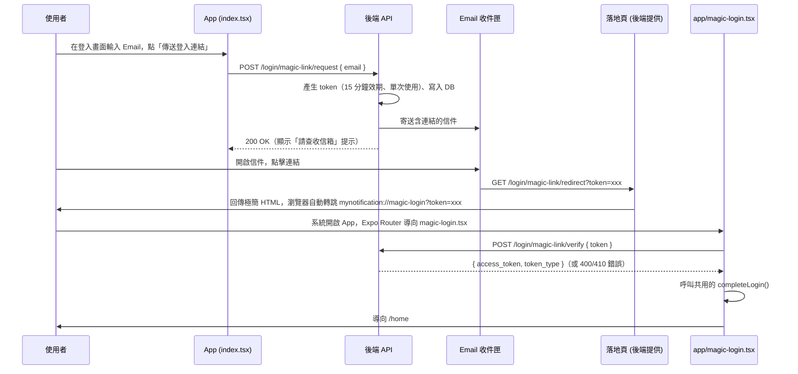

# Plan: Magic Link（Email 連結）登入（前端）

## Goal
在現有的帳密登入、Google 登入之外，新增第三種登入方式：使用者只要輸入 Email，系統寄一封含有登入連結的信，使用者點擊信件中的連結即可完成登入，不需要輸入密碼。完成定義：登入畫面可以用既有的 Email 欄位觸發「傳送登入連結」，使用者從信箱點擊連結後，App 會自動開啟並完成登入（行為與帳密/Google 登入一致：存 Token、同步 Push Token、導向 `/home`）。

後端（FastAPI，由 `back-end` session 負責）需新增寄信、token 產生與驗證、資料庫欄位，規格已透過跨 session 訊息與 back-end 確認可行（見下方「已定案的決策」），僅剩寄信服務（Resend／其他）需使用者本人決定並提供 API Key（back-end 會直接跟使用者確認，不用前端重複詢問）。

## 已與使用者確認的決策
- 連結格式：**網頁落地頁轉跳 App**（比純 `mynotification://` 自訂 scheme 更穩定，因為部分 Email App 的內建瀏覽器會擋掉非 http(s) 連結）。落地頁由後端 FastAPI 直接提供一個路由（沿用目前後端已在用的 LAN IP，與現有 API 呼叫方式一致，不需另外申請網域）
- 帳號建立政策：與 Google 登入一致 — **Email 不存在時自動建立新帳號**（`auth_provider='magic_link'`，無密碼）
- Token 有效期：**15 分鐘**，單次使用（用過或過期即失效）

## Architecture / flow

## Scope

### 前端 May modify
- `app/index.tsx`：新增「改用 Email 連結登入」按鈕與 `onRequestMagicLink` 處理函式（讀取表單目前的 Email 欄位值，呼叫請求 API，成功後 `Alert` 提示查收信箱）
- 新增 `app/magic-login.tsx`：Expo Router 會自動把 `mynotification://magic-login?token=xxx` 對應到這支檔案。畫面邏輯：讀取 `token` query param → 呼叫驗證 API → 成功呼叫共用 `completeLogin()` → 失敗顯示錯誤訊息與「返回登入」連結
- **重構**：把 `app/index.tsx` 內的 `completeLogin(accessToken)` 抽到共用模組（例如新增 `services/authFlow.ts`），讓 `index.tsx`（帳密/Google 登入）與新的 `magic-login.tsx` 都能呼叫同一份收尾邏輯，避免重複程式碼

### 必須不修改（Core，交由既有機制）
- `store/useAuthStore.ts`：沿用既有 `setUserToken` 邏輯
- `services/api.ts`：沿用既有 axios 攔截器
- `app.json` 的 `scheme`：已存在（`mynotification`），不需改動
- Google 登入、帳密登入既有流程：僅做「抽出共用函式」的重構，不改變其行為

### 後端（由 back-end session 負責，前端不直接修改）
- 新增 `POST /api/v1/login/magic-link/request`，body: `{ email }`
- 新增 `POST /api/v1/login/magic-link/verify`，body: `{ token }`，回應格式與現有登入 API 一致
- 新增 `GET /api/v1/login/magic-link/redirect?token=xxx`：回傳極簡 HTML，內容為 meta-refresh 或 JS 轉跳到 `mynotification://magic-login?token=xxx`
- 新增資料表（例如 `magic_link_tokens`）：`token_hash`、`email`、`expires_at`、`used_at`、`created_at`
- 寄信服務：**需要 back-end 確認是否已有 SMTP / 第三方寄信服務（SendGrid、Resend、AWS SES 等）**，若沒有需要額外設定

## Existing patterns to follow
- 沿用 Google 登入（`plan.md`）建立的前後端協調模式：先送規格提案給 `back-end` session，取得確認後再動工
- 沿用 `completeLogin()` 的收尾邏輯（存 Token、同步 Push Token、`Alert` + 導頁），重構為共用函式後兩種新登入方式都呼叫它
- 錯誤處理沿用 `try/catch` + `Alert.alert('錯誤', detail)` 的樣式
- `app/magic-login.tsx` 是一個「處理中」畫面，UI 上可參考 `register.tsx` 的 `ActivityIndicator` loading 樣式

## Constraints
- 落地頁使用後端目前的 LAN IP（`EXPO_PUBLIC_API_URL` 同一台主機），代表**寄出的信只能在測試手機與後端同一區網時才點得開**——這與目前整個 App 開發階段的限制一致（API 本身也是用 LAN IP），非新增限制，但正式上線前需要後端有公開網域
- 需等待 back-end 確認 API 契約、資料庫欄位、寄信服務可行性後才能定案（目前為前端提案版本）
- `app/magic-login.tsx` 需處理「App 冷啟動時直接由這個連結開啟」與「App 已在背景執行時被喚醒」兩種情境（Expo Router 對這兩種情境都會建立/導航到同一個路由，實作時需注意 `useLocalSearchParams()` 在两種情境下都能正確拿到 token）

## Verification
- 3 個端對端測試：
  1. Happy path：既有帳號使用者輸入 Email 索取連結 → 收到信 → 點擊連結 → App 開啟並完成登入，導向 `/home`
  2. Error case：使用已經用過的連結再次點擊 → 顯示「連結已失效，請重新索取」，不會登入成功
  3. Error case：等待超過 15 分鐘後才點擊連結 → 顯示「連結已過期，請重新索取」
- 手動驗證：實機測試信件內容中的連結格式在常見信箱 App（Gmail、iOS 內建郵件）點擊後是否能正確喚醒 App

## Done definition
- [ ] 上述 3 個 e2e 測試情境皆通過
- [ ] 後端三支 API 與資料庫欄位已與 back-end 確認並實作完成
- [ ] `completeLogin()` 重構為共用函式，且原本帳密/Google 登入行為不變（需重新手動測試一次，確保沒有回歸）
- [ ] `app/magic-login.tsx` 對「連結有效」「已使用」「已過期」三種情境都有對應的畫面提示

## Risks & rollback
- 風險：Email 可能被歸類為垃圾信（尤其後端若無正式的寄信服務、直接用個人 SMTP 寄送）→ 需與 back-end 確認寄信服務的可送達性
- 風險：落地頁用 LAN IP，換了網路環境（例如後端電腦重開機後 LAN IP 改變）會讓已寄出但還沒點的連結失效 → 屬於已知限制，待後端有正式網域再解決
- Rollback：移除 `app/magic-login.tsx`、`app/index.tsx` 中新增的按鈕與 `services/authFlow.ts` 即可回滾，不影響既有帳密/Google 登入

## back-end 已確認的補充設計
- **寄信服務目前完全沒有**：back-end 會直接跟使用者確認要用哪個服務並取得 API Key（推薦 Resend：HTTPS API、免費額度夠開發階段用、sandbox 模式不用先驗證網域），前端不用重複詢問使用者
- 落地頁掛在現有 FastAPI、用 LAN IP：**確認可行**。因為自訂 URL scheme 深連結不是 iOS Universal Links / Android App Links，不需要網域驗證機制，跟現有 App 依賴 LAN IP 的做法一致
- **安全性設計**：`GET /login/magic-link/redirect` 只單純轉跳、**不會**在這一步消耗 token（避免 Outlook/Gmail 的信件安全掃描機器人預先點擊連結導致 token 被提前用掉）；token 真正被消耗是在 App 呼叫的 `POST /verify` 那一步。資料庫只存 token 的 hash，不存明文
- **帳號建立政策比 Google 登入單純**：email 不存在 → 建立新帳號（`auth_provider='magic_link'`）；email 已存在（不論原本是 password/google）→ 直接登入，**不會**改動既有的 `auth_provider`，不需要額外的綁定判斷邏輯
- **防濫用**：`/login/magic-link/request` 不會依 email 是否存在回傳不同結果（防帳號枚舉），並加上同一 email 60 秒 cooldown（防止被拿來灌信騷擾別人信箱）
- `magic_link_tokens` 資料表欄位（`token_hash` / `email` / `expires_at` / `used_at` / `created_at`）與雜湊方式由 back-end 決定，前端不需要介入
- back-end 目前已可以先動工不依賴寄信服務的部分（建表、`/verify` 端點骨架），等寄信服務決定後再串起來

## 開放問題（待使用者決定，back-end 會直接詢問）
- 寄信服務要用哪個（Resend / 其他）？需要提供對應的 API Key

## 實作進度
- ✅ 新增 `services/authFlow.ts`：把原本 `app/index.tsx` 裡的 `completeLogin` 抽成獨立函式（用 `useAuthStore.getState()` 與 `expo-router` 的 imperative `router` API，不依賴 React hook，讓非畫面元件的 `magic-login.tsx` 也能呼叫）
- ✅ `app/index.tsx`：改用共用的 `completeLogin`（帳密、Google 登入行為不變），新增「改用 Email 連結登入（免密碼）」連結與 `onRequestMagicLink`（讀取表單目前的 Email 欄位值，簡單用 zod 驗證格式後呼叫 API）
- ✅ 新增 `app/magic-login.tsx`：deep link 落地畫面，讀取 `token` query param 呼叫 `/verify`，成功呼叫 `completeLogin()`，失敗顯示錯誤訊息 + 返回登入按鈕；用 `useRef` 防止同一個 token 被重複驗證
- ✅ `app/_layout.tsx`：把 `magic-login` 路由移到登入狀態判斷之外，確保不論已登入/未登入都能被 deep link 導航到
- ✅ `npx tsc --noEmit` / `npx expo lint` 通過（無新增錯誤或警告）
- ✅ 後端三支 API 已上線：`POST /login/magic-link/request`（回傳 204 No Content，前端 `axios.post` 對 2xx 一律視為成功，不需改程式碼）、`GET /login/magic-link/redirect`、`POST /login/magic-link/verify`
- ⚠️ **測試限制**：Resend 目前是 sandbox 模式，只能寄信到使用者當初註冊 Resend 帳號的那個 Email，寄給其他信箱會「靜默失敗」（前端不會收到錯誤，只是使用者收不到信）。整合測試時務必用那個特定 Email 索取連結，避免誤判為前端或後端出問題
- ✅ **使用者實機測試通過**（Development Build，完整流程：輸入 Email → 收信 → 點連結 → App 自動登入）
