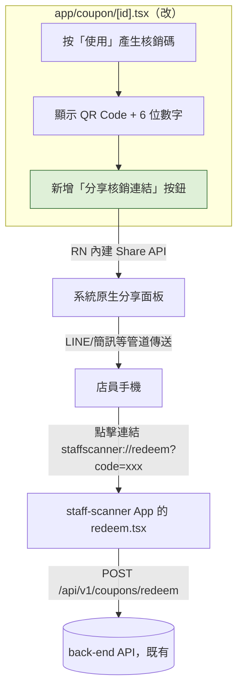

# Plan: 優惠券核銷 — 分享核銷連結（QR 掃描失敗備援）

## Goal
顧客在優惠券詳情頁（`app/coupon/[id].tsx`）產生核銷碼後，除了現有的 QR Code + 6 位數字顯示，新增一個「分享核銷連結」按鈕。按下後用系統原生分享面板把核銷碼與可直接開啟店員端 App（`staff-scanner`，由另一個 Claude Code session `staff`負責）核銷畫面的 deep link 一起分享出去（例如透過 LINE、簡訊傳給店員），作為相機掃 QR 失敗（光線不佳、鏡頭故障）時的備援手動核銷管道。完成的定義：核銷碼有效期內顯示分享按鈕，分享出去的連結能在裝有 `staff-scanner` dev build 的 HTC 測試機上被點開並成功核銷。

已跟 `staff` session 確認（2026-09-06）：
- 他們的 QR 掃描（`scan.tsx`）跟這次要新增的 deep link 是兩條獨立路徑，deep link 走 `staffscanner://redeem?code=xxx` → 他們的 `redeem.tsx` 直接讀 query param 的 `code`，兩條路徑最後共用同一個核銷畫面。
- 目前的 6 位數字格式完全相容，不需要改成 JSON 或其他結構化格式。

## Architecture / flow

## Scope

### May modify
- `app/coupon/[id].tsx` — 新增分享按鈕與 `onShareCode` handler，用 `react-native` 內建的 `Share.share()`（不是 `expo-sharing`，那個是給檔案分享用的，這裡只分享文字）

### Must not modify
- `services/shop.ts`、後端、`staff-scanner`（他們的 `scan.tsx`／`redeem.tsx` 已確認相容，不需要改動）
- 現有的 QR Code／人工核銷輸入框邏輯

## Existing patterns to follow
- 沿用 `coupon/[id].tsx` 既有的 `redeemCode`／`remainingSeconds`／`isCodeExpired` 狀態判斷分享按鈕該不該顯示
- 按鈕樣式沿用既有的 `styles.button`／`styles.buttonText`
- 錯誤提示沿用既有的 `Alert.alert` 寫法

## Constraints
- 不新增第三方套件（RN 內建 `Share` API 就夠用）
- deep link 的 scheme／path（`staffscanner://redeem?code=xxx`）是 `staff` 那邊的既有格式，這裡只能組字串代入 `code`，不可自行更動格式
- 只有核銷碼還沒過期（`!isCodeExpired`）時才顯示分享按鈕，跟現有「重新產生核銷碼」按鈕共用同一個判斷條件

## Verification
- 3 個端對端測試：
  1. Happy path：產生核銷碼 → 按「分享核銷連結」→ 系統分享面板出現 → 選 LINE 傳送 → 在裝有 `staff-scanner` dev build 的 HTC 測試機上點開收到的連結 → 觸發 App 開啟並導到核銷畫面、code 已帶入 → 核銷成功，回到 `coupon/[id].tsx` 的優惠券變成已使用
  2. 錯誤案例：核銷碼倒數過期後，分享按鈕應隨著既有的「核銷碼已過期，請重新產生」提示一起消失／不可按，不能分享出一個已過期的連結卻沒有任何提示
  3. 錯誤案例：使用者叫出分享面板後按「取消」（未選擇任何 App），畫面正常返回，不跳出錯誤 Toast／Alert
- 手動驗證：以 Android 為主（分享面板行為 Android/iOS 有差異，iOS 測試本來就卡在沒有 Apple Developer 帳號）；確認分享出去的文字在 LINE 訊息裡可讀、連結可點擊
- 不涉及長時間流程，不需要額外 stress test

## Done definition
- [ ] 分享按鈕只在核銷碼有效期內顯示，過期後正確隱藏
- [ ] 分享內容包含人類可讀的核銷碼文字 + `staffscanner://redeem?code=xxx` 連結
- [ ] 在 HTC 測試機的 `staff-scanner` dev build 上實測，點擊分享出的連結能成功開啟並完成核銷
- [ ] PR/commit 說明正確標示 AI 協作
- [ ] 沒有動到 `coupon/[id].tsx` 以外的檔案

## Risks & rollback
- 風險：`staff-scanner` 的 deep link scheme 若之後改變（例如改用 universal link），這裡組的字串要跟著更新——已跟 `staff` 確認目前格式穩定，如有變動需求他們會先知會（見專案記憶 `redeem_code_contract`）
- 風險：iOS 上 `Share.share()` 的行為/選單樣式跟 Android 不同，這次先以 Android 實機驗證為主
- Rollback：單一檔案改動，`git diff`／還原 `app/coupon/[id].tsx` 即可完整回退

## Open questions
- 無，已跟 `staff` session 確認核銷碼格式與 deep link 相容，不需要等對方變更
