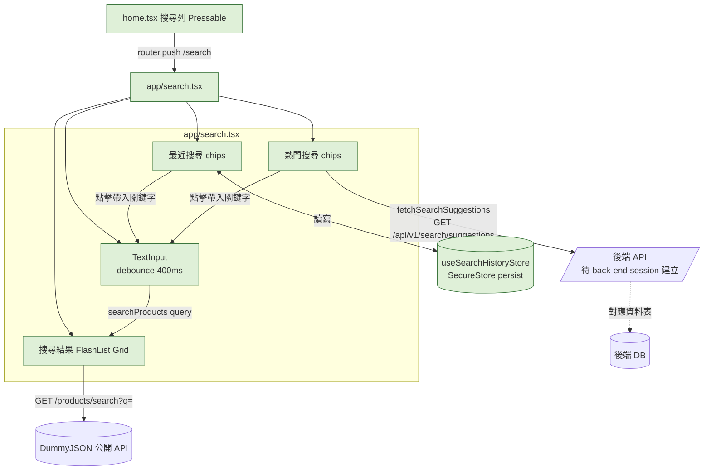

# Plan: 商品搜尋功能

## Goal
使用者（App 的一般消費者）目前在首頁只能靠「商品分類標籤」瀏覽或滑到隨機洗牌出的 12 筆商品，找不到直接用關鍵字搜商品的方式。這個功能要讓使用者在首頁頂部點一個搜尋列，進到一個獨立的搜尋頁面：可以打字即時（debounce）搜尋 DummyJSON 商品、看到自己最近搜尋過的關鍵字（存在裝置本機）、以及後端資料庫提供的「熱門搜尋/推薦標籤」（點一下直接帶入該關鍵字查詢）。完成的定義：首頁有可點擊的搜尋列 → 進到 `app/search.tsx` → 打字 400ms 後自動出現搜尋結果 Grid；沒打字時看得到最近搜尋記錄（可清除）跟熱門搜尋標籤；熱門標籤內容來自後端 API，不是寫死在前端。

## Architecture / flow

## Scope

### May modify
- `app/(drawer)/(tabs)/home.tsx`（新增可點擊的搜尋列，放在問候語與小輪播之間，`router.push('/search')`）
- `app/search.tsx`（新檔案：搜尋頁面，含輸入框、最近搜尋、熱門標籤、搜尋結果 Grid）
- `app/_layout.tsx`（新增 `Stack.Screen name="search"`，`headerShown: true`、`title: '搜尋商品'`，比照 `coupon/[id]` 的寫法）
- `store/useSearchHistoryStore.ts`（新檔案：比照 `useFavoritesStore.ts` 的 persist 寫法，本機存最近搜尋關鍵字）
- `services/products.ts`（新增 `searchProducts(query)`，打 DummyJSON `/products/search?q=`）
- `services/search.ts`（新檔案：`fetchSearchSuggestions()`，透過 `services/api.ts` 的 `api` 實例打後端熱門搜尋 API；後端 API 還沒好之前先回傳/使用前端 fallback 陣列，不擋住這版上線）

### Must not modify
- `services/api.ts`（沿用現有攔截器，不改動）
- `store/useFavoritesStore.ts`、`store/useAuthStore.ts`、`store/useNotificationStore.ts`
- 其他既有畫面（`favorites.tsx`／`coupons.tsx`／`inbox.tsx`／`settings.tsx` 等）
- 後端程式碼（不在這個 repo，需要的新 API 由 `back-end` session 負責，這裡只消費）

## Existing patterns to follow
- 搜尋結果 Grid 比照 `home.tsx` 的 `GRID_COLUMNS = 3` FlashList 卡片版面（`productCard`/`productThumb`/`productTitle`/`productPrice` 那組 style，可以直接複用邏輯、不用整個複製貼上）
- 最近搜尋記錄比照 `store/useFavoritesStore.ts`：`persist` middleware + `expo-secure-store` 當 storage backend，同一個 `secureJSONStorage` 寫法
- 熱門搜尋走後端 API 這件事，資料表設計比照 `plan.md`（首頁 promo banner）裡討論過的「營運可控坑位」思路：一張通用表，欄位大致是 `keyword`、`sort_order`、`is_active`，API 回傳依排序、啟用中的清單
- 頁面導航統一用 `router.push('/search')`（不含路由群組前綴），比照 `settings.tsx` 既有寫法；`app/search.tsx` 放在根目錄（不在 `(drawer)` 群組內），跟 `coupon/[id].tsx`／`register.tsx` 一樣屬於 `app/_layout.tsx` 的 `Stack.Screen`，這樣可以拿到原生的返回箭頭，不會重演之前 Drawer 頁面「進去後回不去」的問題
- 搜尋 API 呼叫用 debounce（開一個 400ms 的 `useEffect` + `setTimeout` 或簡單的 debounce hook），避免使用者每打一個字就發一次 request

## Constraints
- 不新增第三方套件（`debounce` 自己用 `setTimeout`/`useEffect` 刻，不用另外裝 lodash）
- DummyJSON 的 `/products/search` 是公開測試 API，純展示用，跟自家後端商品資料無關（跟首頁現況一致）
- 熱門搜尋標籤如果後端 API 還沒準備好，要有前端 fallback（例如幾個固定關鍵字），不能讓搜尋頁因為這支 API 失敗就整頁壞掉
- 最近搜尋記錄只存在裝置本機，不同步後端，數量上限建議 10 筆、避免無限累積

## Verification
- 3 個端對端測試（手動操作，肉眼確認）：
  1. Happy path：首頁點搜尋列 → 進到搜尋頁 → 打「shirt」等 3 秒內不用按任何按鈕就看到結果 Grid 出現 → 點其中一張商品卡（若有串到詳情頁的話）或至少確認資料正確顯示
  2. 最近搜尋：搜尋兩三個不同關鍵字後回到搜尋頁空白狀態，確認「最近搜尋」有依時間新到舊列出，點一下能直接帶入該關鍵字並觸發搜尋
  3. 熱門標籤失敗保護：暫時把 `fetchSearchSuggestions` 的後端網址改錯（或斷網測試後端那段），確認熱門標籤區塊優雅降級（顯示 fallback 或直接不顯示），不會讓整個搜尋頁白屏
- 手動驗證：實機打幾個中英文關鍵字（含查無結果的關鍵字），確認空結果狀態文案正常
- 不涉及長時間執行流程，不需要額外的 stress test

## Done definition
- [ ] 首頁新增可點擊的搜尋列，點擊後導向 `/search`
- [ ] `/search` 頁面：debounce 400ms 即時搜尋 DummyJSON 商品，結果用 3 欄 Grid 呈現
- [ ] 最近搜尋記錄存在本機（`useSearchHistoryStore`），可點擊帶入、有上限
- [ ] 熱門搜尋標籤來自後端 API（`services/search.ts`），API 尚未就緒時有 fallback，不會讓頁面壞掉
- [ ] 已跟 `back-end` session 溝通熱門搜尋 API 的契約（路徑、回傳格式、資料表欄位）
- [ ] PR/commit 說明正確標示 AI 協作

## Risks & rollback
- 風險：後端熱門搜尋 API 由另一個 session 負責，時程不受控——用 fallback 陣列解耦，前端這版可以先上線，之後 API 好了再串正式資料，不會互相卡進度
- 風險：DummyJSON 是公開測試服務，`/products/search` 之後如果改版或降速，會直接影響搜尋體驗——跟首頁現況風險等級一致，先接受
- Rollback：新增的檔案（`search.tsx`／`useSearchHistoryStore.ts`／`search.ts`）直接刪除即可；`home.tsx`／`app/_layout.tsx`／`services/products.ts` 的改動用 `git diff` 還原對應區塊

## Open questions
- 熱門搜尋 API 的正式路徑/欄位命名需要 `back-end` session 確認，這版先假設 `GET /api/v1/search/suggestions` 回傳 `{ keyword: string }[]`，實際命名以 `back-end` session 回覆為準
