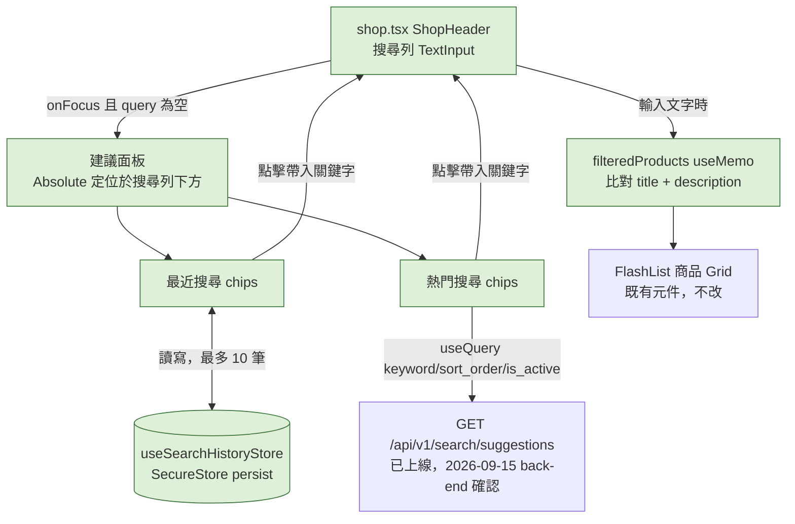

# Plan：商店搜尋加強（shop.tsx）

> **2026-09-15 改版說明（含一次規劃過程中的更正）**：這份 plan 原本規劃的是幫首頁（`home.tsx`）的 DummyJSON 展示用商品輪播/Grid 做一個獨立搜尋頁（含最近搜尋記錄、熱門標籤）。規劃當下誤以為這個舊版規劃「從沒真的做」，因而先改成只講「加強真商店 `shop.tsx` 搜尋」——**這個前提是錯的**：`app/search.tsx` 其實早在 2026-09-06（commit `7b50bd1`）就已經完整實作並上線，首頁搜尋列（`home.tsx`）本來就會 push 過去，debounce／最近搜尋（`store/useSearchHistoryStore.ts`）／熱門標籤（`services/search.ts`）全部都在跑，不是空白待辦。這次改版動工時才發現這個落差（見下方教訓）。
>
> 實際定案：**首頁展示頁的獨立搜尋頁維持原樣，不動**；這份 plan 現在單純是「另外*加強*真商店 `shop.tsx` 既有的陽春搜尋列（只比對標題、無最近搜尋/熱門標籤）」，兩個搜尋頁面並存、服務不同商品系統（展示 vs. 真的可買），**共用同一份 `useSearchHistoryStore`／`fetchSearchSuggestions`**，不重複造一份。下面的 mermaid/Scope 都是這個「加強 shop.tsx」的範圍，不涉及 `app/search.tsx`。
>
> **教訓**：規劃時判斷「這個功能做了沒」，一定要先用檔名/內容直接 grep repo（`find`/`grep` 全專案，不是只查自己以為相關的幾個檔名），不能只憑對話記憶或部分檢查就下結論——這是今天第二次犯這類錯誤（backlog.md 那次也是），且這次差點造成實際程式碼損壞（動工時 `Write` 直接覆蓋掉已存在、正在被 `app/search.tsx` 使用的 `store/useSearchHistoryStore.ts`／`services/search.ts`，改動了介面名稱跟回傳型別，導致既有搜尋頁編譯失敗；已用 `git checkout` 復原兩個檔案並改成沿用原本介面）。

## Goal

`shop.tsx` 現有的搜尋列只比對商品標題（`product.title.toLowerCase().includes(keyword)`），沒有比對商品描述、沒有最近搜尋記錄、也沒有熱門搜尋建議，使用者要嘛得完全打對關鍵字，要嘛得自己滑分類標籤找。這次要讓搜尋更好用：比對範圍加上商品描述、聚焦搜尋列時顯示「最近搜尋」（裝置本機）與「熱門搜尋」（後端 `GET /api/v1/search/suggestions`，2026-09-15 確認已上線）標籤，點擊任一個標籤直接帶入該關鍵字並套用篩選。完成的定義：搜尋列比對標題+描述；點擊/聚焦搜尋列時看到最近搜尋（可清除、最多留 10 筆）與熱門搜尋標籤；點擊任一標籤立即套用篩選並收起建議面板；後端熱門標籤 API 失敗或回空陣列時整個熱門標籤區塊優雅隱藏，不影響其餘搜尋功能。

**跟原本 DummyJSON 版規劃的關鍵差異**：這裡是本機即時過濾已抓到的資料（`useMemo`），不是每次打字都呼叫 API，所以**不需要 debounce**——這比原本設計簡單，直接在既有 `filteredProducts` 的 `useMemo` 邏輯上擴充比對欄位即可。

## Architecture / flow

## Scope

### May modify
- `app/(drawer)/(tabs)/shop.tsx`（`ShopHeader` 元件新增聚焦時的建議面板 UI；`filteredProducts` 的 `useMemo` 比對範圍加上 `product.description`）
- `store/useSearchHistoryStore.ts`、`services/search.ts`（**既有檔案，2026-09-06 已隨 `app/search.tsx` 建立，不是新檔案**——`shop.tsx` 直接 import 沿用同一份 `useSearchHistoryStore`（`keywords`/`addKeyword`/`clearHistory`）與 `fetchSearchSuggestions()`，兩邊「最近搜尋」是同一份清單、熱門標籤是同一份後端資料，不另外拆一份給商店頁專用）

### Must not modify
- `app/(drawer)/(tabs)/home.tsx`、`services/products.ts`（首頁 DummyJSON 展示頁完全不碰，這次改版的教訓就是不要混到這個系統）
- `services/api.ts`（沿用現有攔截器）
- `store/useFavoritesStore.ts`、`store/useCartStore.ts`
- `services/shop.ts` 的 `fetchShopProducts`（資料抓取邏輯不變，一次抓全部、本機過濾的架構維持不變）
- 商品 Grid 卡片本身（`renderItem`/收藏愛心按鈕等）不動，只動 `ShopHeader` 跟過濾邏輯

## Existing patterns to follow
- 最近搜尋記錄比照 `store/useFavoritesStore.ts`：`persist` middleware + `expo-secure-store` 當 storage backend，同一個 `secureJSONStorage` 寫法
- 熱門標籤資料表設計沿用 back-end 已經上線的 `keyword`/`sort_order`/`is_active` 結構（跟 `plan.md` 討論過的「營運可控坑位」通用表思路一致），前端只消費、排序照後端回傳順序
- 建議面板的聚焦顯示/收起邏輯，比照 `home.tsx` 或其他既有畫面用 `useState` 管理 UI 狀態的簡單模式，不需要額外的動畫套件（可以先用簡單的條件渲染，之後想加 fade in/out 再用 Reanimated，不是這次必要項目）
- 熱門標籤 API 失敗保護比照現有畫面對外部 API 失敗的處理方式（例如 `PromoCarousel` 圖片抓取失敗時的優雅降級），這裡是直接把整個熱門標籤區塊隱藏（`data.length === 0` 或 `isError` 時 `return null`），不影響最近搜尋跟商品 Grid

## Constraints
- 不新增第三方套件（chips/tag UI 直接用現有的 `Pressable` + `StyleSheet`，比照 `home.tsx` 商品分類標籤的樣式）
- 熱門搜尋標籤資料表目前應該是空的（back-end 確認沒有後台 CRUD，要手動 insert 測試資料）——開發時如果看到空陣列是正常現象，不是 API 壞掉，back-end 那邊會先塞幾筆測試關鍵字方便驗證
- 最近搜尋記錄只存裝置本機，不同步後端，上限 10 筆
- 比對範圍加 `description` 後，如果搜尋結果變得太寬泛（例如常見字出現在很多商品描述裡），先不特別處理排序權重（標題比對 > 描述比對），這次只求「找得到」，排序精細化留到之後有需要再做

## Verification
- 3 個端對端測試（手動操作，肉眼確認）：
  1. Happy path：點擊搜尋列（尚未打字）→ 看到最近搜尋（如果有）+ 熱門標籤 → 點一個熱門標籤 → 立即套用篩選、建議面板收起、Grid 顯示對應結果
  2. 描述比對：搜一個只出現在某商品「描述」但不在「標題」裡的關鍵字，確認該商品有出現在結果中（驗證比對範圍真的擴大了，不是只改了 UI）
  3. 最近搜尋：搜尋兩三個不同關鍵字後清空搜尋列，確認「最近搜尋」依時間新到舊列出、有清除功能、上限 10 筆時最舊的會被擠掉
- 手動驗證：熱門標籤資料表為空時（目前應該就是這個狀態），確認熱門標籤區塊正確隱藏、不噴錯誤、不留空白區塊
- 不涉及長時間執行流程，不需要額外的 stress test

## Done definition
- [x] `shop.tsx` 搜尋比對範圍擴大到商品描述
- [x] 聚焦搜尋列時顯示最近搜尋（本機、可清除、上限 10 筆）
- [x] 聚焦搜尋列時顯示熱門搜尋標籤（後端 API，失敗/空陣列時優雅隱藏）
- [x] 點擊最近搜尋/熱門標籤任一個都能立即帶入關鍵字並套用篩選
- [x] 首頁 DummyJSON 展示頁完全沒被改動
- [x] 3 個端對端測試都通過——2026-09-15 使用者實機確認 TEST OK
- [ ] PR/commit 說明正確標示 AI 協作——尚未 commit

## 補充（2026-09-15，跟這份 plan 間接相關）——已解決
熱門搜尋標籤原本的 6 筆資料（沐浴乳／收納盒／文具／廚房用品／香氛／寢具）跟實際英文商品標題對不上、點了搜不到結果。已請 back-end 改成 iPhone／MacBook／Samsung／Huawei／Watch／Shoes，back-end 已更新並用 `Product.title ILIKE` 核對過都有實際匹配（7/1/5/1/5/4 筆），`GET /api/v1/search/suggestions` 現在回傳這 6 筆。待實機在 `shop.tsx`／`app/search.tsx` 各點一輪確認顯示正常。

## Risks & rollback
- 風險：`ShopHeader` 目前是 `FlashList` 的 `ListHeaderComponent`，建議面板如果用 absolute 定位疊在 Grid 上方，要注意 FlashList 的捲動/測量機制會不會跟 absolute 元素互相干擾（測量高度異常、捲動跳動）——實作時先用簡單的條件渲染（面板出現時把 Grid 往下推，不用 absolute 覆蓋），如果版面過度跳動再改成 absolute + 手動控制 z-index
- 風險：搜尋比對範圍加大到描述後，如果某些商品描述文字很長且包含常見詞，可能讓某些關鍵字搜出過多不直覺的結果——先觀察實際使用情況，不預先過度設計排序權重
- Rollback：只有 `shop.tsx` 一處修改（新增 import + `ShopHeader`/`ShopScreen` 的建議面板邏輯），`useSearchHistoryStore.ts`／`services/search.ts` 是既有共用檔案、這次沒有異動，`git diff`/還原 `shop.tsx` 即可完整回退，不影響其他既有畫面（含 `app/search.tsx`）

## Open questions
- 熱門標籤實際會塞哪些關鍵字內容（back-end 說先塞幾個常見分類詞）——這不影響前端實作，純粹是資料內容，可以之後再調整
