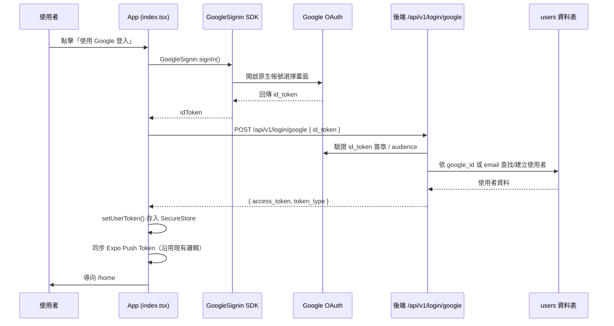

# Plan: Google 帳號第三方登入（前端）

## Goal
現有登入方式僅支援 Email + 密碼（`POST /api/v1/login/access-token`）。使用者要求新增「使用 Google 帳號」登入，讓使用者可以用原生 Google 帳號選擇畫面快速登入/註冊，不需要另外輸入 Email 密碼。完成定義：在登入畫面（`app/index.tsx`）新增「使用 Google 登入」按鈕，點擊後跳出原生 Google 帳號選擇畫面，選擇帳號後即可自動登入並導向 `/home`，行為與現有帳密登入流程一致（存 Token、同步 Push Token、導頁）。

後端（FastAPI，由另一個 Claude Code session `back-end`負責）需新增對應 API 與資料庫欄位，已透過跨 session 訊息與 back-end 確認規格（見下方「已定案」），僅剩 Google Cloud Console OAuth 憑證需使用者本人建立。

## 前後端已定案的決策
- 前端套件：`@react-native-google-signin/google-signin`（原生 Google 登入按鈕，非瀏覽器 OAuth 流程）
- 帳號綁定策略：若使用者用 Google 登入、Email 與既有密碼帳號相同 → 後端自動綁定 `google_id` 到既有帳號（後端會額外檢查 Google 回傳的 `email_verified` 為 true 才綁定，防止帳號接管）
- 資料庫：`users.hashed_password` **已經是 nullable**（先前 migration 已處理，不需再新增 migration）
- 後端會新增 `users.google_id`（String, nullable, unique, indexed）與 `users.auth_provider`（標記 `'password' / 'google' / 'both'`）
- 後端驗證 id_token 方式：`google-auth` 套件的 `google.oauth2.id_token.verify_oauth2_token`（離線驗證，audience 比對 `GOOGLE_CLIENT_ID` = Web Client ID）
- API Response 與現有 `/login/access-token` 完全一致：`{ "access_token": ..., "token_type": "bearer" }`（直接複用 `security.create_access_token`）
- 因需要原生模組 + 自訂 URL scheme，**必須改用 EAS Development Build 測試**，無法在純 Expo Go 中測試此功能

## Architecture / flow

## Scope

### 前端 May modify
- `app/index.tsx`：新增「使用 Google 登入」按鈕與 `onGoogleLogin` 處理函式
- `app/register.tsx`：視需要加上「或使用 Google 註冊」入口（可選，導向同一支 Google 登入邏輯）
- `app.json`：新增 `@react-native-google-signin/google-signin` 的 config plugin 設定（iOS urlScheme）
- `package.json`：新增依賴 `@react-native-google-signin/google-signin`
- `.env`：新增 `EXPO_PUBLIC_GOOGLE_WEB_CLIENT_ID`（GoogleSignin.configure 需要 webClientId）
- 新增 `services/googleAuth.ts`（封裝 `GoogleSignin.configure` 初始化與 `signIn` 呼叫，供 index.tsx 使用）

### 必須不修改（Core，交由既有機制）
- `store/useAuthStore.ts`：沿用現有 `setUserToken` / SecureStore 邏輯，不新增 Google 專屬狀態欄位
- `services/api.ts`：沿用現有 axios 攔截器機制
- `app/(tabs)/_layout.tsx` 的 push token 同步邏輯：Google 登入後沿用現有流程，不重複實作

### 後端（由 back-end session 負責，前端不直接修改）
- 新增 `POST /api/v1/login/google` API（路徑掛載方式與現有 `/login/access-token` 一致）
- `users` 資料表新增 `google_id`（nullable, unique, indexed）與 `auth_provider`（'password' / 'google' / 'both'）
- `.env` 新增 `GOOGLE_CLIENT_ID`（Web Client ID，後端驗證 id_token 用）
- 新增 `google-auth` 依賴

## Existing patterns to follow
- 沿用 `app/index.tsx` 中 `onLogin` 的結構：呼叫登入 API → `setUserToken(accessToken)` → 嘗試取得並同步 Expo Push Token → `Alert.alert` 成功訊息 → `router.replace('/home')`
- 錯誤處理沿用相同的 `try/catch` + `Alert.alert('錯誤', detail)` 樣式
- 按鈕樣式沿用 `styles.button` / `Pressable` 的視覺回饋模式（pressed 效果、disabled 狀態）

## Constraints
- 必須改用 EAS Development Build（`eas build --profile development`）測試，Expo Go 不支援原生 Google 登入模組
- 需要在 Google Cloud Console 建立 OAuth 2.0 用戶端 ID（Web、iOS、Android 各一組）— 這是**使用者需要手動在 Google Cloud Console 操作的步驟**，無法由程式碼完成，需確認由誰的 Google Cloud 專案建立（見開放問題）
- Android 需提供簽章 SHA-1 指紋給 Google Cloud Console 設定 Android OAuth Client
- 後端 API 契約以 back-end session 回覆為準，前端串接邏輯需等待確認後才能定案（目前 plan 內容為前端提案版本）

## Verification
- 3 個端對端測試：
  1. Happy path：已有 Email/密碼帳號的使用者，用同一 Email 的 Google 帳號登入 → 預期自動綁定成功，登入後導向 `/home`，且用密碼登入同一帳號仍可成功（因為帳號已合併）
  2. Error case：全新 Email（資料庫不存在）用 Google 登入 → 預期自動建立新帳號（`password_hash` 為 NULL）並登入成功；之後嘗試用密碼登入該帳號應失敗並提示錯誤（因為從未設定密碼）
  3. Error case：Google 登入流程中使用者於帳號選擇畫面按下取消 → App 不應顯示錯誤彈窗（區分「使用者取消」與「真正的網路/伺服器錯誤」），並停留在登入畫面
- 手動驗證：在 EAS Development Build（實機或模擬器）上實際測試 Google 帳號選擇畫面是否正常彈出、id_token 是否成功換到後端 JWT

## Done definition
- [ ] 上述 3 個 e2e 測試情境皆通過
- [ ] 後端 `POST /api/v1/login/google` 契約已與 back-end session 確認並實作完成
- [ ] `app.json` 的 Google Sign-In config plugin 設定正確，EAS Development Build 可正常編譯
- [ ] 未修改 `store/useAuthStore.ts` 既有邏輯以外的內容
- [ ] Google 登入按鈕的 UI 風格與現有登入畫面一致

## Risks & rollback
- 風險：Google Cloud OAuth Client ID 設定錯誤（audience 不符）會導致後端驗證 id_token 失敗 → 需前後端共同對照 Client ID 設定
- 風險：帳號自動綁定策略如果 Email 驗證有誤判（例如 Google 回傳的 email 未驗證 `email_verified: false`）可能造成帳號被冒用 → 後端驗證 id_token 時應檢查 `email_verified` 欄位
- Rollback：Google 登入為新增功能、不影響既有密碼登入路徑，直接移除按鈕與 `services/googleAuth.ts`、還原 `app.json`/`package.json` 變更即可回滾，不影響既有使用者資料

## 開放問題（待使用者決定）
- ~~back-end 是否同意上述 API 契約與資料庫欄位設計？~~ → **back-end 已確認可行**，細節已同步進上方「已定案的決策」
- ~~iOS Bundle ID / Android Package name 要用什麼？~~ → **已確認**：`com.stevenchouis.mynotification`（已寫入 `app.json` 的 `ios.bundleIdentifier` / `android.package`）
- **Google Cloud Console 的 OAuth 用戶端 ID（Web / iOS / Android）進度**：
  - ✅ Web Client ID 已取得：`993805207886-a3qm59hml1qs0k4lp9li294fe4839dmd.apps.googleusercontent.com`（已寫入前端 `.env` 的 `EXPO_PUBLIC_GOOGLE_WEB_CLIENT_ID`；已通知 `back-end` session 設進 `GOOGLE_CLIENT_ID`）
  - ✅ iOS Client ID 已取得：`993805207886-8m26i9g27ngu1d2kmbnt0qgo2kg19jph.apps.googleusercontent.com`，Reversed Client ID：`com.googleusercontent.apps.993805207886-8m26i9g27ngu1d2kmbnt0qgo2kg19jph`（已寫入 `.env` 的 `EXPO_PUBLIC_GOOGLE_IOS_CLIENT_ID`；Reversed Client ID 之後要寫入 `app.json` 的 `@react-native-google-signin/google-signin` config plugin `iosUrlScheme`）。Bundle ID 已核對一致（`com.stevenchouis.mynotification`）
  - ✅ Android Client ID 已取得：`993805207886-i22d7a78ig03q2adqtrkb29gt36ecc8c.apps.googleusercontent.com`（SHA-1 用 EAS 管理的 Keystore；此組 ID 不需寫進前端程式碼，由 Google Play 服務依 package name + SHA-1 自動比對）

三組 Client ID 已全數到齊，前端實作已完成第一階段（見下方「實作進度」）。
- `register.tsx` 是否也要加 Google 選項？→ 暫定**只在登入畫面提供入口**（Google 登入本身同時涵蓋註冊與登入，帳號會在後端自動建立），如需在 `register.tsx` 也加入口再告知

## 實作進度
- ✅ `npm install @react-native-google-signin/google-signin`
- ✅ `app.json` 新增 config plugin（`iosUrlScheme` 設為 iOS Client 的 Reversed Client ID）
- ✅ `.env` 新增 `EXPO_PUBLIC_GOOGLE_WEB_CLIENT_ID`、`EXPO_PUBLIC_GOOGLE_IOS_CLIENT_ID`
- ✅ 新增 `services/googleAuth.ts`：封裝 `GoogleSignin.configure` 與 `signInWithGoogle()`（處理使用者取消的情況，回傳 `null` 而非拋錯）
- ✅ `app/index.tsx`：抽出共用的 `completeLogin(accessToken)` 收尾流程（帳密登入與 Google 登入共用），新增「使用 Google 登入」按鈕與 `onGoogleLogin`
- ✅ `npx tsc --noEmit` / `npx expo lint` 通過（無新增錯誤或警告）
- ✅ 後端 `/login/google` 已上線，DB migration 已套用（`google_id`、`auth_provider` 欄位確認存在），業務邏輯與當初提案一致（自動綁定需 `email_verified=true`，否則回 400）
- ⏳ 尚未實機測試（需要 EAS Development Build，見下方「下一步」）

## 下一步（需要使用者執行）
1. 建置 Development Build：`eas build --profile development --platform android`（或 `ios`）
2. 安裝到裝置/模擬器後，於登入畫面測試「使用 Google 登入」按鈕，完整跑一次登入流程（後端已就緒，可以做整合測試）
