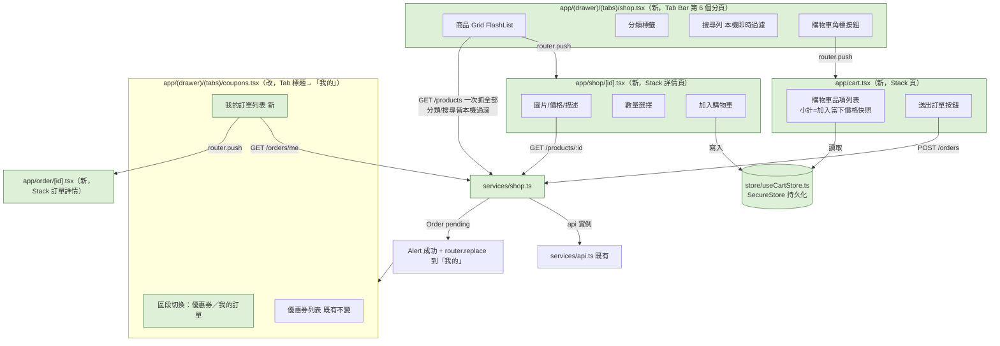

# Plan: 商店（購物車 + 結帳）功能

## Goal
使用者要在 `mynotification` 加入一條完整獨立於現有 DummyJSON 展示頁的真實購物流程：瀏覽自家後端商品（`back-end` session 剛完成的 `GET /api/v1/products`，含分類篩選與站內搜尋）、加入購物車、送出訂單（`POST /api/v1/orders`）、在既有的「我的優惠券」分頁（改名為「我的」）查看訂單記錄（`GET /api/v1/orders/me`）。完成的定義：Tab Bar 新增「商店」分頁，可以用分類標籤與搜尋列篩選商品 Grid；點商品進獨立的商品詳情頁可以選數量、加入購物車；購物車畫面可以調整/移除品項、按「送出訂單」呼叫後端；成功後顯示訂單狀態為 `pending`（**這次不做 ECPay 收銀台導轉**，等後端拿到金鑰後再補）；原本的「我的優惠券」分頁改名為「我的」，內容除了既有的優惠券區塊，新增一個「我的訂單」區塊可以查歷史訂單、點進去看明細。既有的 DummyJSON 展示頁（首頁／收藏／搜尋）完全不動、不共用程式碼。

## Architecture / flow

## Scope

### May modify / create
- `services/shop.ts`（新）— `fetchShopProducts()`／`fetchShopProductById(id)`／`createOrder(items)`／`fetchMyOrders()`，全部透過既有的 `services/api.ts` 的 `api` 實例呼叫
- `types/shop.ts`（新）— `ShopProduct`／`Order`／`OrderItem`／`OrderStatus` 型別
- `store/useCartStore.ts`（新）— 本機購物車，比照 `store/useFavoritesStore.ts` 的 Zustand `persist` + SecureStore 寫法
- `app/(drawer)/(tabs)/shop.tsx`（新）— 商店分頁：一次抓全部商品（`GET /products`，不分頁，只有 194 筆），分類標籤與搜尋列都是**本機即時過濾**這份已抓到的資料，不會每次切分類/打字都重新打 API
- `app/shop/[id].tsx`（新）— 商品詳情頁
- `app/cart.tsx`（新）— 購物車頁
- `app/order/[id].tsx`（新）— 訂單詳情頁
- `app/(drawer)/(tabs)/coupons.tsx`（**改**）— Tab 標題改「我的」；畫面內加一個頂部區段切換（優惠券／我的訂單）兩個分頁按鈕，既有優惠券篩選/列表邏輯完全不變，只是包進「優惠券」這個區段；新增「我的訂單」區段渲染訂單列表（`fetchMyOrders()`），點進去導到 `app/order/[id].tsx`
- `app/(drawer)/(tabs)/_layout.tsx` — 新增一個 `Tabs.Screen name="shop"`，`tabBarBadge` 讀 `useCartStore` 品項數量（比照現有「我的收藏」`favoriteCount` 徽章寫法）；`coupons` 分頁的 `title` 改成「我的」
- `app/(drawer)/_layout.tsx` — `TAB_TITLES.coupons` 從 `'我的優惠券'` 改成 `'我的'`；新增 `shop: '商店'`
- `app/_layout.tsx` — 在 `Stack.Protected guard={!!userToken}` 區塊內新增 3 個 `Stack.Screen`（`shop/[id]`／`cart`／`order/[id]`，都是 `headerShown: true` + `headerBackTitle: '返回'`，比照現有 `coupon/[id]`／`search` 的寫法）

### Must not modify
- `services/products.ts`、`app/(drawer)/(tabs)/home.tsx`、`app/(drawer)/(tabs)/favorites.tsx`、`app/search.tsx` — DummyJSON 展示頁，刻意保持獨立、不共用程式碼
- `store/useFavoritesStore.ts` — 收藏/願望清單改存 DB 是另一個獨立範圍（見 `backlog.md`），這次不動
- `coupons.tsx` 既有的優惠券篩選/排序/隱藏舊資料邏輯——只是外面包一層區段切換，內部行為不變
- 不做 ECPay 收銀台導轉（WebView/瀏覽器跳轉），等 `back-end` 補上「導去綠界的網址/表單參數」端點後再開新 plan

## Existing patterns to follow
- **列表 + 詳情頁結構**：比照 `app/(drawer)/(tabs)/coupons.tsx` + `app/coupon/[id].tsx`（`Pressable` 卡片、詳情頁在 `app/` 底下的 Stack 路由、`Alert` 顯示錯誤/成功訊息）—— `order/[id].tsx` 是同一套邏輯換資料源
- **商品 Grid + 分類/搜尋**：比照 `home.tsx` 的 `FlashList<Product>` + `numColumns={3}` 卡片版面、`categoryScroll`/`categoryTab` 分類標籤樣式；搜尋列樣式比照 `search.tsx` 的 `searchBar`（但這裡不用 debounce/不用另開畫面，本機陣列 `.filter()` 即時算)
- **本機持久化 store**：比照 `store/useFavoritesStore.ts` 的 `persist` + `secureJSONStorage` 寫法
- **主題**：所有新/改動畫面用 `useThemeColors()` + `useMemo(() => createStyles(colors), [colors])`
- **圖片**：一律用 `expo-image` 的 `Image`
- **API 呼叫**：一律從 `services/api.ts` 匯入共用的 `api` 實例
- **區段切換 UI**：比照 `coupons.tsx` 既有的篩選 Pill（`filterTab`/`filterTabActive`）樣式，新增的「優惠券／我的訂單」切換做成同樣視覺語言的兩顆大 Pill

## Constraints
- 不新增第三方套件（`react-native-webview` 等 ECPay 導轉需要的套件留到下一個 plan 再裝）
- 分類清單不額外呼叫後端 API（back-end 目前沒有 `/products/categories` 端點）——用第一次 `GET /products` 抓回的完整 194 筆資料，前端自己 `Set` 出不重複的 `category` 值來畫分類標籤
- 搜尋是本機 `title`/`description` 字串比對（`includes`），不是後端全文搜尋——194 筆資料量小，不需要額外的搜尋 API
- 訂單金額/庫存以後端回應為準；購物車畫面顯示的小計只是「加入購物車當下價格 × 數量」的估算值，要清楚標示「僅供參考，實際金額以送出結果為準」
- 結帳按鈕文案要誠實反映目前只到 `pending` 狀態（例如用「送出訂單」而非「立即付款」）

## Verification
- 3 個端對端測試（手動操作，肉眼確認）：
  1. Happy path：商店分頁看到商品 Grid，點分類標籤確認只顯示該分類商品，打搜尋關鍵字確認即時過濾 → 點一個商品進詳情頁 → 選數量 2 → 加入購物車 → 分頁角標數字變成 2 → 進購物車看到正確品項與數量 → 送出訂單 → 顯示成功訊息（pending）→ 導到「我的」分頁，切到「我的訂單」區段，看到剛剛那筆排最上面 → 點進去看到品項明細與 `merchant_trade_no`
  2. 錯誤案例：手動把某商品庫存改 0（或調整數量超過庫存）再結帳，確認後端回 409 時畫面顯示清楚錯誤訊息，購物車內容保留可調整重試
  3. 錯誤案例：購物車是空的時候，「送出訂單」按鈕 disabled 或提示「購物車是空的」，不會送出空 items 請求
- 手動驗證：實機淺色/深色模式各跑一次 Happy path；App 完全關閉重開後購物車品項還在；「我的」分頁在「優惠券」/「我的訂單」兩個區段來回切換時既有優惠券功能（篩選/核銷連結）沒有壞掉
- 不涉及長時間執行流程，不需要額外的 stress test

## Done definition
- [x] 商店分頁：Grid、分類標籤、搜尋列都正常運作（本機過濾）——程式碼已完成，待實機驗證
- [x] 商品詳情頁可選數量並加入購物車——程式碼已完成，待實機驗證
- [x] 購物車頁可調整數量／移除品項，送出訂單成功顯示 pending 狀態——程式碼已完成，待實機驗證
- [x] 「我的」分頁新增「我的訂單」區段，既有優惠券區段功能不變——程式碼已完成，待實機驗證
- [ ] 3 個端對端測試都通過——待實機操作驗證
- [x] 首頁／收藏／搜尋（DummyJSON 展示頁）完全沒被改動
- [ ] PR/commit 說明正確標示 AI 協作——尚未 commit

## Risks & rollback
- 風險：Tab Bar 從 5 個變 6 個，小螢幕裝置圖示可能太擠，需要實機確認排版
- 風險：`coupons.tsx` 是既有已上線的畫面，這次改動要小心別動到既有優惠券篩選/排序/核銷連結的行為，只加不改
- 風險：購物車只在本機（SecureStore），換裝置/重灌 App 會消失——使用者已確認不需要跨裝置同步
- 風險：`POST /orders` 目前只到 `pending`，UI 文案需清楚溝通避免誤導成已付款成功
- Rollback：全部是新檔案 + 4 處小範圍修改（`(tabs)/_layout.tsx`、`(drawer)/_layout.tsx`、根 `_layout.tsx`、`coupons.tsx`），`git diff`/還原這幾個檔案即可完整回退

## Open questions
- ~~`home.tsx` 的 QuickActions「我的優惠券」入口、`settings.tsx` 選單的「我的優惠券」文字要不要一起改？~~ **已確認：一起改成「我的」**，兩處連去的仍是同一個 `/coupons` 路由不變，`home.tsx` 的 `QUICK_ACTIONS` 常數與 `settings.tsx` 的選單項文字都同步更新，納入 May modify 清單。
